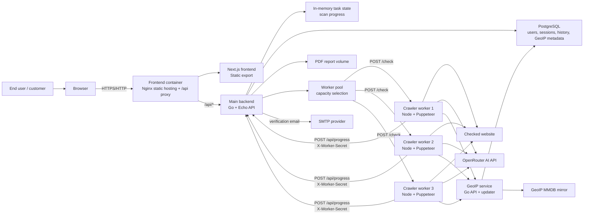
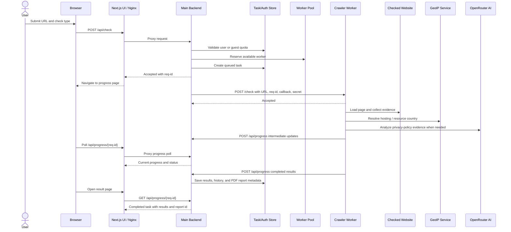
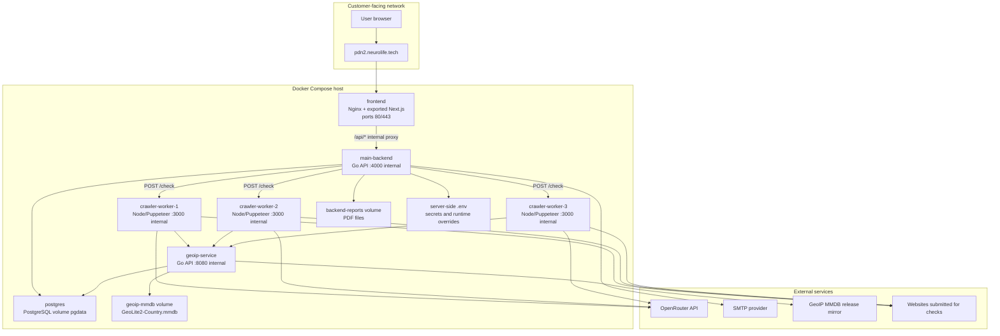

# Architecture

This document is the maintained architecture index for PDn-control. It describes the current delivered architecture, links the maintained view sources, and records the main architecture decisions that affect quality, maintainability, and deployment.

## Overview

PDn-control is a Docker Compose web product for checking websites against FL-152-related compliance concerns. The customer-facing path is a browser talking to an nginx-served exported Next.js frontend. The frontend proxies API requests to a Go/Echo main backend. The backend coordinates authentication, guest limits, scan progress, report history, PDF report storage, and crawler dispatch. Node/Puppeteer crawler workers perform website evidence collection and call the GeoIP service and OpenRouter where needed. PostgreSQL stores auth/session/history/report metadata and GeoIP update metadata.

Maintained view sources:

- [Static view source](static-view/component-diagram.mmd)
- [Dynamic view source](dynamic-view/scan-sequence.mmd)
- [Deployment view source](deployment-view/deployment-diagram.mmd)

## Static View: Component Diagram

The component diagram shows the main internal components, external services, and communication paths. The strongest cohesion is around service responsibilities: frontend rendering/proxying, backend orchestration and persistence, crawler execution, and GeoIP lookup/update behavior are separated. Coupling remains highest between the backend and crawler callback contract because progress, worker secrets, result shape, history, and PDF generation all meet there.

This design supports [QR-001](../quality-requirements.md#qr-001-scan-dispatch-responsiveness) by keeping worker selection in a focused backend pool and supports [QR-003](../quality-requirements.md#qr-003-invalid-input-protection) by validating requests before dispatch. It constrains maintainability where shared result formats cross the backend/frontend/worker boundary; those contracts should stay tested and documented.

Relevant ADRs: [ADR-001](adr/ADR-001-docker-compose-service-boundaries.md), [ADR-002](adr/ADR-002-asynchronous-crawler-workers.md).

## Dynamic View: Website Scan Flow

This sequence represents the primary product workflow: a user submits a website, the backend accepts the scan quickly, a worker performs the long-running browser check, and the UI follows progress through polling. The scenario is important because it crosses the main architectural boundaries: UI, proxy, backend validation, worker pool, crawler workers, GeoIP, AI, persistence, and PDF/report state.

The sequence helps reason about dispatch responsiveness, callback security, error handling, and eventual consistency between progress state and final report data. The key architecture decision is [ADR-002](adr/ADR-002-asynchronous-crawler-workers.md): scans are asynchronous so the customer does not wait for browser automation in the original request.

## Deployment View

The deployment model was chosen because the product has several runtime dependencies but can still be operated as one Docker Compose stack. It supports customer access through a single frontend/proxy container while keeping backend, workers, database, GeoIP, and report storage on the internal Docker network.

The model supports maintainability by making service boundaries explicit in `docker-compose.yml`. It constrains operations because the server must provide correct `.env` values, persistent volumes, DNS/HTTPS routing for `pdn2.neurolife.tech`, and external access to OpenRouter, SMTP, submitted websites, and the GeoIP mirror. Operators must avoid committing secrets and must keep product access evidence separate from private credentials.

Relevant ADR: [ADR-001](adr/ADR-001-docker-compose-service-boundaries.md).

## ADR Index

- [ADR-001: Docker Compose Service Boundaries](adr/ADR-001-docker-compose-service-boundaries.md)
- [ADR-002: Asynchronous Crawler Workers](adr/ADR-002-asynchronous-crawler-workers.md)
- [ADR-003: Mermaid Maintained Architecture Diagrams](adr/ADR-003-mermaid-maintained-architecture-diagrams.md)

Together, the ADRs explain why PDn-control keeps explicit service boundaries, why crawler work is asynchronous, and why architecture diagrams are maintained as repository text. These decisions connect the codebase to the maintained quality requirements and make later product changes easier to reason about in PR review.
