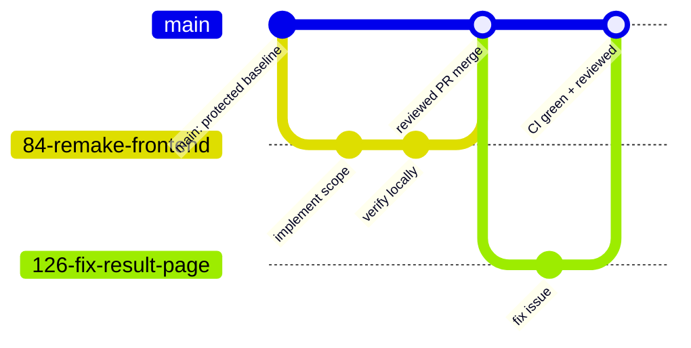

# Development Process and Configuration Management

This document is the maintained description of how the PDn-control team plans, develops, reviews, configures, verifies, and releases repository changes. It covers the current GitHub-based workflow used for product code, documentation, QA, and maintained process artifacts.

## Work Management

The Product Backlog is maintained as GitHub issues in the public repository, with stable user-story references mirrored in [docs/user-stories.md](user-stories.md). User stories, technical PBIs, testing tasks, bugs, and maintained documentation work use the issue templates in [`.github/ISSUE_TEMPLATE/`](../.github/ISSUE_TEMPLATE/).

Sprint work is selected by assigning issues to the active Sprint milestone. The Sprint milestone is the authoritative Sprint Backlog container; it records the Sprint goal, dates, selected PBIs, and current status where GitHub exposes it. Weekly reports summarize the selected Sprint scope and link the relevant milestone, issues, PRs, and evidence.

The team uses these Work Status values consistently in issues, Sprint reports, and board-style views:

| Status | Entry criteria |
|---|---|
| `To Do` | The item is in the Product Backlog but is not selected and ready for current Sprint execution. |
| `Ready` | The item is selected for the Sprint, estimated, assigned, has acceptance criteria, and can start without major missing context. |
| `In Progress` | An implementer has started the work on a dedicated branch. |
| `Review` | The issue-linked PR is open or ready for peer review. |
| `Done` | Acceptance criteria and the Definition of Done are satisfied, evidence is preserved, CI passes, and the PR is merged to `main`. |

## Git Workflow

The repository uses short-lived branches and pull requests into the protected default branch, `main`. Feature, bug, documentation, and configuration changes all go through the same review path.



The diagram shows the team workflow: create a branch from an issue, make focused commits, open a PR, let GitHub Actions run quality gates, receive review from another team member, then merge into `main` after acceptance criteria and the Definition of Done are satisfied.

Branch names should follow `ISSUE_NUMBER-short-description`, for example `126-fix-result-page`. PR descriptions use the repository PR template, link the related issue with `Closes #...`, list testing performed, and confirm acceptance-criteria verification. PR authors do not review their own work; another team member reviews the change before merge.

Issues are closed by linked PRs where possible. If an issue is deferred or no longer planned, the issue should preserve the decision and rationale instead of disappearing from traceability.

## Configuration And Secrets

Runtime configuration is supplied through Docker Compose environment variables, service config files, and server-side secret storage. Local and deployment secrets are kept in `.env`, which is ignored by Git. The committed sanitized example is [`.env.example`](../.env.example).

Important configuration sources:

| Source | Purpose | Public or private |
|---|---|---|
| `.env.example` | Sanitized list of expected environment variables. | Public, committed. |
| `.env` | Local or server-specific secrets and overrides. | Private, ignored. |
| `docker-compose.yml` | Service topology, container environment wiring, volumes, and ports. | Public, committed. |
| `backend/main-backend/config.json` | Default main-backend config, worker list, Free/Paid scan entitlements, rolling quota, and local defaults. | Public, committed, no real secrets. |
| `backend/crawler-worker/config.json` | Worker defaults for crawler checks, OpenRouter model, and GeoIP service URL. | Public, committed, no real API key. |
| GitHub Actions workflow files | CI jobs, quality gates, and link checking. | Public, committed. |

Secrets include `OPENROUTER_API_KEY`, `WORKER_SECRET`, SMTP credentials, production database credentials if overridden, and private product access credentials. These values must not be committed to the repository, included in public reports, or shown in screenshots. If a secret is accidentally committed, it must be rotated immediately and removed according to the sensitive-data incident process in the course repository requirements.

## Development Environment

The default reproducible path is Docker Compose from the repository root:

```bash
docker compose up --build
```

For focused local checks, developers can run package-level commands:

```bash
cd backend/main-backend && go test ./...
cd backend/geoip-service && go test ./...
cd frontend && npm.cmd run check && npm.cmd test -- --coverage
cd backend/crawler-worker && npm.cmd run typecheck && npm.cmd test -- --coverage
```

On Windows PowerShell, use `npm.cmd` if script execution policy blocks `npm.ps1`.

## CI, QA, And Delivery

GitHub Actions run on pull requests and pushes to `main`.

- [Quality Gates](../.github/workflows/quality.yml) runs Go formatting/static analysis/tests/coverage, frontend lint/typecheck/build/tests/coverage, crawler typecheck/tests/coverage, automated quality requirement tests, and dependency vulnerability scans.
- [Link Checker](../.github/workflows/link-check.yml) runs Lychee against repository Markdown. Exclusions must be narrow and documented when a link is unstable, private, local-only, or otherwise unsuitable for automated checks.

The project does not use continuous deployment from GitHub Actions in this partial Assignment 5 scope. Deployment is performed by running Docker Compose on the target server with server-side `.env` values. Release and deployment evidence is preserved through reports, changelog entries, PRs, CI runs, and SemVer releases when the full assignment scope requires them.
