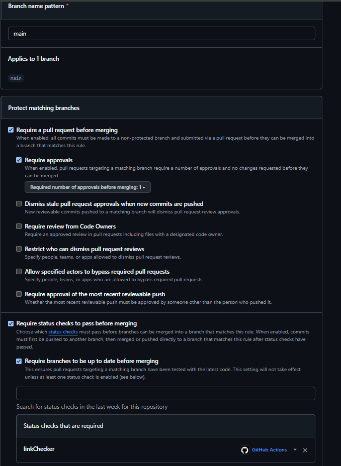
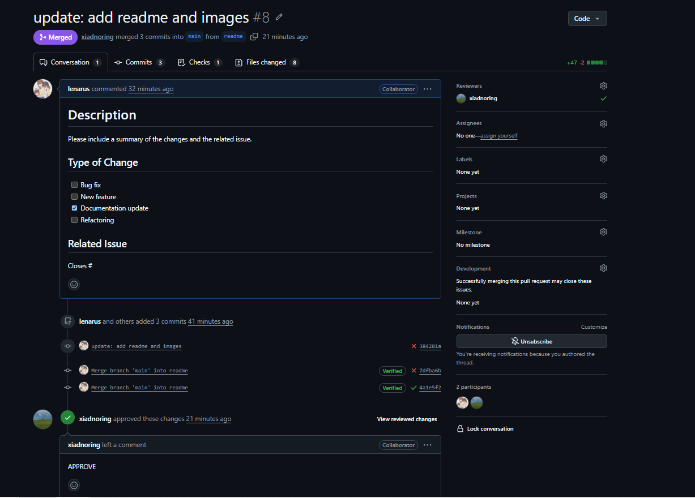
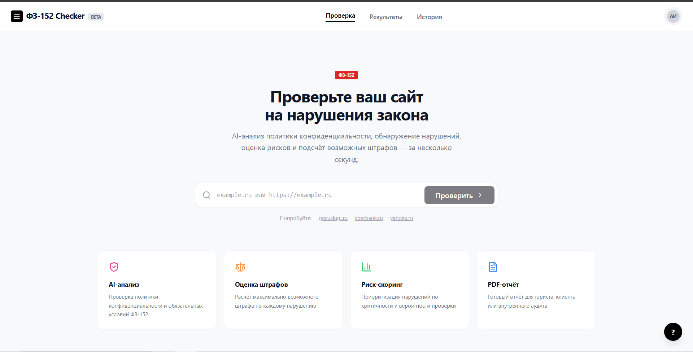
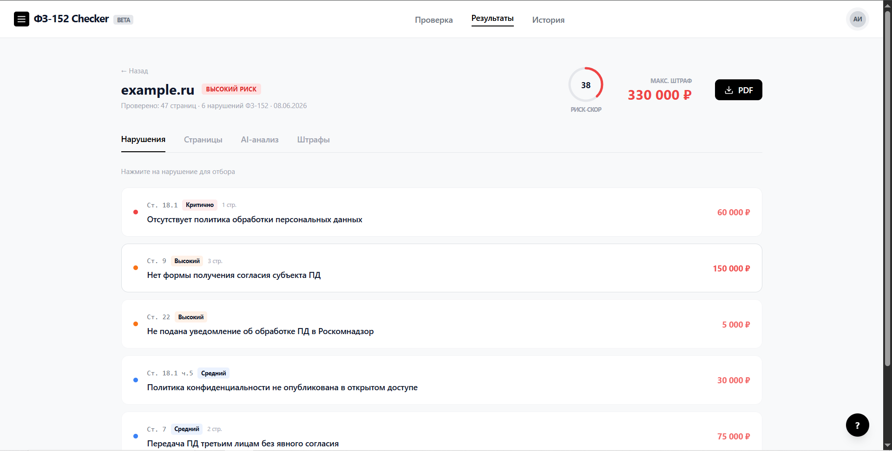
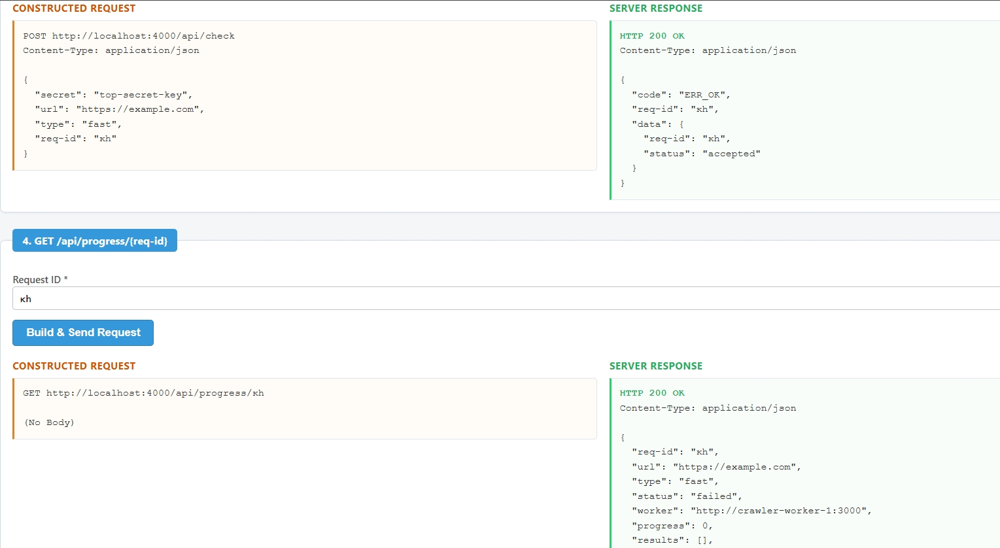
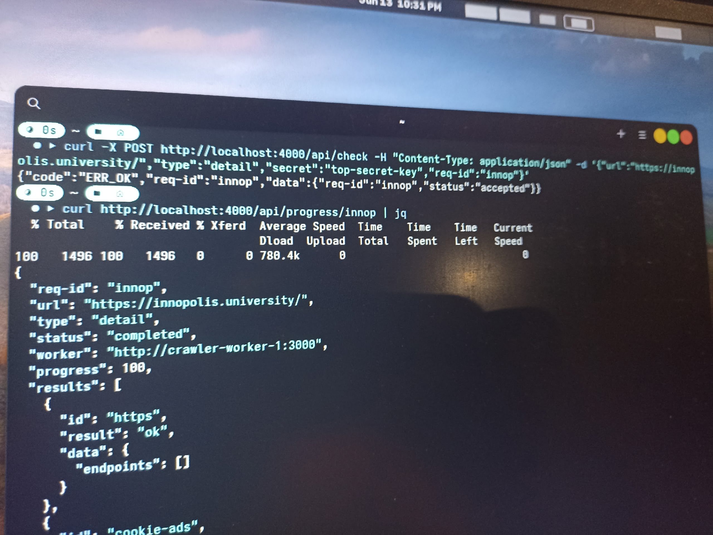
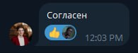

# PDn Control — Week 2 Report

**Project:** PDn Control — A website compliance checker for Federal Law No. 152 (FL-152).

## Repository

- [LICENSE](../../LICENSE) (MIT)
- [Root README](../../README.md) — includes local setup, Docker, and run instructions

## User Stories

- [User Stories](user-stories.md) — 9 stable user stories (US-01 through US-09) with MoSCoW priorities

## Prototype and Interface Artifacts

### Graphical Interface — Frontend Prototype

- **Interactive prototype:** 2.56.183.107:8080 - Not relevant right now.
- **Source:** [`frontend/`](../../frontend/) (React + Vite + Tailwind CSS)

### API Interface

- **OpenAPI specification:** [`api/openapi.yaml`](../../api/openapi.yaml)
- **Swagger UI:** [`frontend/swagger.html`](../../frontend/swagger.html) — interactive API test console available at the frontend URL
- **Postman collection:** [`api/postman_collection.json`](../../api/postman_collection.json)
- **API video demonstration:** [Yandex Disk — API Preview](https://disk.yandex.ru/i/YQJS24cyq4vlFg)

### Other Non-Graphical Interface

- **Interactive mock/demonstration:** The deployed frontend prototype at [http://2.56.183.107:8080/](http://2.56.183.107:8080/) serves as the interactive demonstration.
- **Interface documentation:** See [API specification](../../api/openapi.yaml) and [MVP v0 Report](mvp-v0-report.md).

## MVP v0

- [MVP v0 Report](mvp-v0-report.md) — architecture, technology stack, and implementation details
- **Deployed MVP v0:** [http://2.56.183.107:8080/](http://2.56.183.107:8080/)
- **Run instructions:** See [Root README](../../README.md) — requires Docker Compose and Node.js
- **Video demonstration:** [Google Drive — Frontend Preview](https://drive.google.com/file/d/18236Tzx7L1ns-j0dkFesosEBqWZj3c8a/view?usp=sharing)

## PR/MR Workflow

- **PR template:** [`.github/PULL_REQUEST_TEMPLATE.md`](../../.github/PULL_REQUEST_TEMPLATE.md) — minimal template with description, type of change, and related issue fields

### Reviewed PRs Created During Week 2

| PR # | Branch | Description |
|------|--------|-------------|
| [#1](https://github.com/TemporaryOrganization1/PDn-control/pull/1) | `geoip` | GeoIP microservice in Go — downloads MaxMind DB weekly and stores in PostgreSQL |
| [#2](https://github.com/TemporaryOrganization1/PDn-control/pull/2) | `geoip` | GeoIP update — get country code by IP address from the downloaded MaxMind DB |
| [#3](https://github.com/TemporaryOrganization1/PDn-control/pull/3) | `crawler` | Crawler worker in Node.js |
| [#4](https://github.com/TemporaryOrganization1/PDn-control/pull/4) | `crawler` | Crawler worker implementation |
| [#5](https://github.com/TemporaryOrganization1/PDn-control/pull/5) | `crawler2` | Crawler worker fixes and improvements |
| [#6](https://github.com/TemporaryOrganization1/PDn-control/pull/6) | `E7425-patch-1` | Updated US-06 |
| [#7](https://github.com/TemporaryOrganization1/PDn-control/pull/7) | `prtemplate` | Added PR template |
| [#8](https://github.com/TemporaryOrganization1/PDn-control/pull/8) | `readme` | Added README and images |
| [#9](https://github.com/TemporaryOrganization1/PDn-control/pull/9) | `lychee` | Lychee link checker workflow |

## Lychee Link Checking

- **Configuration:** [`.github/workflows/link-check.yml`](../../.github/workflows/link-check.yml) — runs on push to `main` and on pull requests
- **Latest successful protected-default-branch run:** [GitHub Actions — Run #27502372652](https://github.com/TemporaryOrganization1/PDn-control/actions/runs/27502372652/job/81287465185)

### Excluded Links

The following links are excluded from Lychee checks because they require Docker Compose (backend services) to be available and are not accessible during CI:

- `http://localhost:4000/*` — Main backend API
- `http://localhost:5173/*` — Frontend dev server

All excluded links have been manually verified locally with Docker Compose running and are confirmed working.

## Screenshots

### Protected Default Branch Settings

### Example Reviewed PR/MR

### Selected Prototype and Interface Artifacts

**Frontend Prototype — Landing Page:**

**Frontend Prototype — Scan Results:**

**Swagger UI — API Test Console:**

**Backend Architecture (Docker services running):**

**Customer Consent:**

## Coverage

### Prototype Coverage

The frontend prototype (Without API, API calls needs to be added later) implements a graphical web interface that allows users to:
- Submit a website URL for compliance checking
- View scan progress in real time

These features represent the following stable user-story IDs:
- **US-01** (Website compliance check) — URL submission and scan initiation
- **US-03** (AI-powered verification) — Integration with AI analysis backend (Only displaying, but API has AI-powered verification)
- **US-06** (Total possible fine calculation) — Results display with fine estimates (Only displaying. Without real calculation)
- **US-08** (AI privacy policy analysis) — Privacy policy analysis results (Only displaying, but API  AI privacy policy analysis)

The API interface artifacts (OpenAPI spec, Swagger UI, Postman collection) support the same user stories by documenting and enabling direct interaction with the backend API.

### MVP v0 Coverage

The MVP v0 report ([mvp-v0-report.md](mvp-v0-report.md)) documents:
- The product foundation and architecture decisions
- Technology stack selection rationale (Go for backend services, Node.js for crawling)
- Microservices architecture with three service types (GeoIP, Crawler Worker, Main Backend)
- A repeatable smoke-check scenario (local Docker Compose setup, frontend dev server, API verification)

MVP v0 establishes the foundation for the following user stories:
- **US-01** — Website compliance check (core scanning infrastructure)
- **US-03** — AI-powered verification (AI agent integration in detail scan mode)
- **US-08** — AI privacy policy analysis (worker check infrastructure)

MVP v0 is a product foundation and does not need to implement complete user stories at this stage.

## Customer Meeting

- [Customer Meeting Summary](customer-meeting-summary.md)
- [Customer Meeting Notes](customer-meeting-notes.md)
- [Customer Meeting Transcript](customer-meeting-transcript.md)

## Analysis

- [Week 2 Analysis](analysis.md)

## LLM Report

- [LLM Usage Report](llm-report.md)
