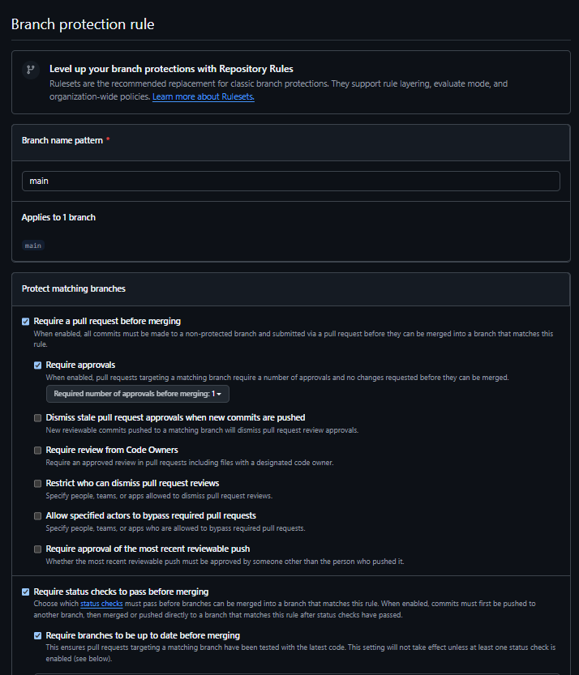
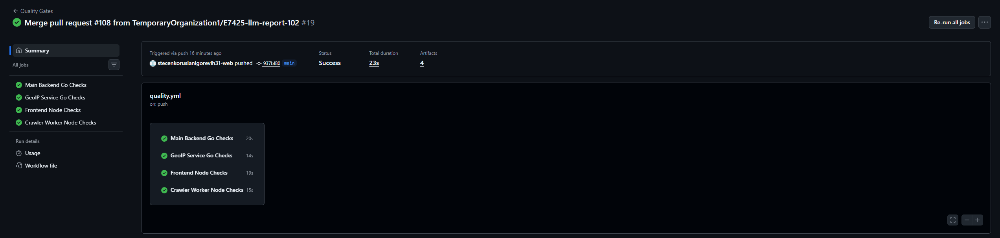
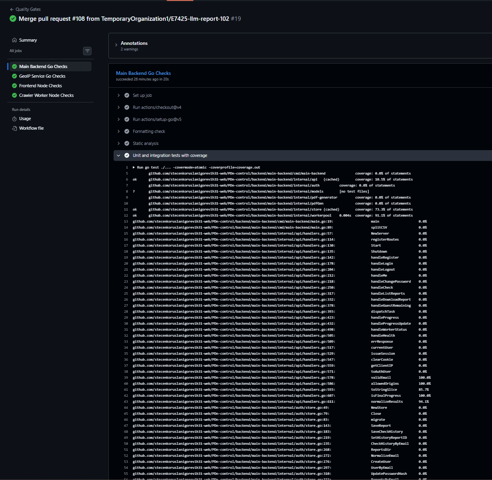
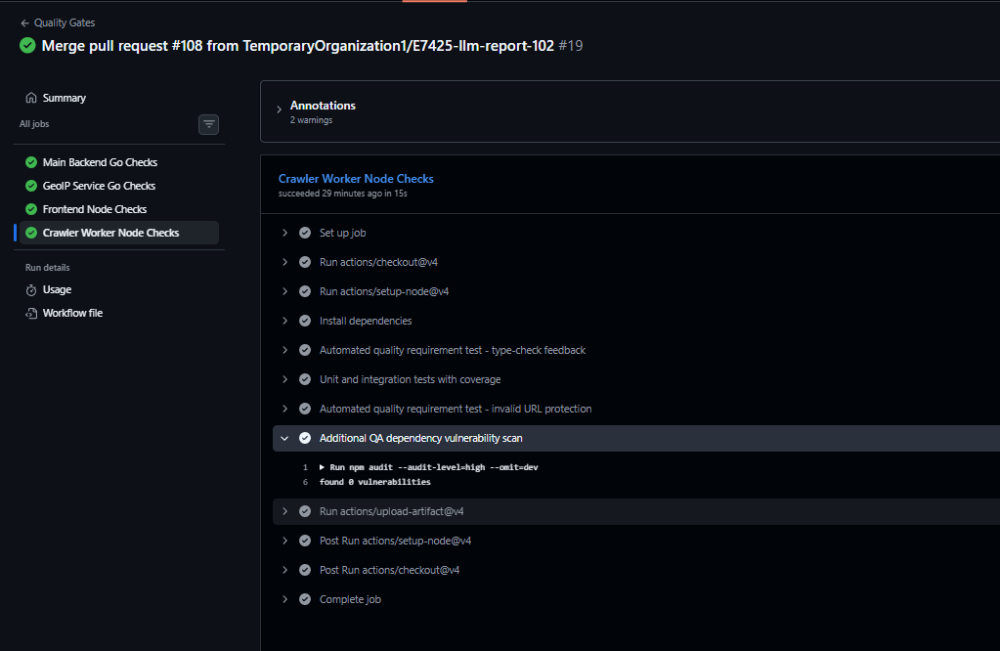

## 1. Produсе

PDn-control is a website compliance checker for Federal Law No. 152 and related Russian regulations.

## 2. Product backlog

https://github.com/orgs/TemporaryOrganization1/projects/2

## 3. Sprint backlog

https://github.com/orgs/TemporaryOrganization1/projects/4

## 4. Milestone

https://github.com/TemporaryOrganization1/PDn-control/milestone/2

## 5. Sprint
- Goal and scope: implement tests, CI configuration, history and pdf report generationm as well as new frontend design
- Date: 22.06.2026 - 28.06.2026

## 6. Story points:
- 13

## 7. Summary of product changes
- PDF report generation
- History of tests

## 8. Link to product

https://pdn2.neurolife.tech/

## 9. Access
The site is publicably available

## 10. Customer Feedback Response

This table summarizes customer feedback from the MVP v1 review in Week 3 and the follow-up Sprint Review/UAT discussion in Week 4. The source evidence is the [Week 3 customer review summary](../week3/customer-review-summary.md), [Week 3 customer review transcript](../week3/customer-review-transcript.md), [Week 4 customer review summary](customer-review-summary.md), and [Week 4 customer review transcript](customer-review-transcript.md).

| Feedback point | Resulting PBI or issue | Status | Response |
|---|---|---|---|
| The frontend design was rejected as too weak for a B2C product. The customer requested a substantially better design and recommended using Cursor/Kombai-style tooling. | [#84 Remake overall frontend](https://github.com/TemporaryOrganization1/PDn-control/issues/84) | In progress / carried to next Sprint | A high-priority redesign PBI was created. The new frontend was not ready to demonstrate during the Week 4 review, so the work remains a Sprint 3 priority. |
| Account creation exists, but registration is incomplete without email verification. | [#104 Email verification](https://github.com/TemporaryOrganization1/PDn-control/issues/104) | Planned for next Sprint | Basic authentication was demonstrated, but verification by email was deferred. A dedicated PBI now tracks the required email-code verification flow. |
| PDF report download was missing or incomplete in the MVP v1 review. | [#19 US-002: PDF report generation](https://github.com/TemporaryOrganization1/PDn-control/issues/19), [PR #90](https://github.com/TemporaryOrganization1/PDn-control/pull/90) | Done | PDF report generation and download were implemented and demonstrated in Week 4. |
| Users need history of previous checks in their account. During Week 4, history initially worked locally but not on the deployed server. | [#22 US-005: Query history](https://github.com/TemporaryOrganization1/PDn-control/issues/22), [#82 Frontend for History](https://github.com/TemporaryOrganization1/PDn-control/issues/82), [#83 Backend for History](https://github.com/TemporaryOrganization1/PDn-control/issues/83), [#91 No history on the server](https://github.com/TemporaryOrganization1/PDn-control/issues/91) | Done | History frontend and backend were implemented. The deployed-server history bug was tracked separately and fixed. |
| The Results button should not feel broken when no scan has started; it should explain that there are no results yet and guide the user to start a scan. | [#113 Add empty-state guidance when no scan results exist](https://github.com/TemporaryOrganization1/PDn-control/issues/113) | Backlog / not done this Sprint | The request was captured as a UX improvement PBI after the Week 4 review. It is deferred to a later Sprint because the current Sprint focused on core report/history work and quality automation. |
| The displayed risk score must be based on real scan data, not random placeholder values. | [#24 US-007: Risk-scoring display](https://github.com/TemporaryOrganization1/PDn-control/issues/24) | Open / carried to next Sprint | The placeholder was identified as misleading during the Week 4 review. The existing risk-scoring PBI remains open and should be completed with real scoring logic. |
| `mc.yandex.ru` and similar common Russian analytics/service domains should not create misleading foreign-hosting violations for the checked site. | [#114 Handle common Russian analytics domains without false foreign-hosting violations](https://github.com/TemporaryOrganization1/PDn-control/issues/114) | Backlog / not done this Sprint | A correctness PBI was created to separate the checked site's own infrastructure from known third-party service behavior where feasible. |
| Fine calculation must be available in the report. | [#23 US-006: Total possible fine calculation](https://github.com/TemporaryOrganization1/PDn-control/issues/23) | Open / planned for next Sprint | The customer repeated that fine calculation is required. The feature remains open and is planned for the next Sprint together with real scoring. |
| After the free scan limit, the product should clearly tell the user to buy or subscribe rather than only blocking further checks. | [#115 Define paid subscription prompt after free scan limit](https://github.com/TemporaryOrganization1/PDn-control/issues/115) | Backlog / not done this Sprint | The current guest-limit behavior was implemented, but the paid/subscription conversion flow still needs product wording and UI. A new PBI tracks that follow-up. |

## 11. Feedback Not Addressed In This Sprint

The frontend redesign, email verification, real risk scoring, fine calculation, `mc.yandex.ru` handling, empty Results state, and subscription prompt were not completed in Sprint 2. They were either already present as open PBIs or were converted into new backlog items after the Week 4 review. The team prioritized making the increment demonstrable and verifiable through PDF reports, history, automated tests, quality requirement tests, CI, coverage, and dependency vulnerability scanning.

## 12. Roadmap

https://github.com/TemporaryOrganization1/PDn-control/blob/main/docs/roadmap.md

## 13. Definition of done

https://github.com/TemporaryOrganization1/PDn-control/blob/main/docs/definition-of-done.md

## 14. Quality requirements

https://github.com/TemporaryOrganization1/PDn-control/blob/main/docs/quality-requirements.md

## 15. Quality requirements tests

https://github.com/TemporaryOrganization1/PDn-control/blob/main/docs/quality-requirement-tests.md

## 16. Testing

[docs/testing.md](../../docs/testing.md)

## 17. User acceptance tests

https://github.com/TemporaryOrganization1/PDn-control/blob/main/docs/user-acceptance-tests.md

## Screenshot Items 18-24 Evidence

## 18. Quality model and selected ISO/IEC 25010 sub-characteristics

The project uses the ISO/IEC 25010 quality model. The Assignment 4 quality requirements use three different sub-characteristics: Time behaviour ([QR-001](../../docs/quality-requirements.md#qr-001-scan-dispatch-responsiveness)), Analysability ([QR-002](../../docs/quality-requirements.md#qr-002-type-check-feedback-for-crawler-changes)), and User error protection ([QR-003](../../docs/quality-requirements.md#qr-003-invalid-input-protection)).

## 19. Testing status summary

Critical modules and current line coverage are documented in [docs/testing.md](../../docs/testing.md#critical-modules-and-coverage). The current critical-module coverage values are: main-backend store 73.3%, main-backend workerpool 91.1%, GeoIP downloader 66.7%, frontend API helpers 61.13%, crawler URL parsing 94.44%, crawler HTTPS check 100%, and crawler SSL/TLS check 97.22%.

## 20. Links to unit tests

- [Main backend store tests](../../backend/main-backend/internal/store/store_test.go)
- [Main backend API helper tests](../../backend/main-backend/internal/api/handlers_test.go)
- [Frontend API helper tests](../../frontend/src/api.test.js)
- [Crawler URL and runner tests](../../backend/crawler-worker/tests/)

## 21. Links to integration tests

- [Worker pool HTTP dispatch integration test](../../backend/main-backend/internal/workerpool/pool_test.go)
- [GeoIP downloader HTTP integration test](../../backend/geoip-service/internal/downloader/downloader_test.go)
- [Crawler HTTPS/SSL subscription interaction tests](../../backend/crawler-worker/tests/checks.test.ts)

## 22. Links to automated quality requirement tests

- [Quality requirement test definitions](../../docs/quality-requirement-tests.md)
- [QRT-001 workerpool test](../../backend/main-backend/internal/workerpool/pool_test.go)
- [QRT-002 crawler type-check gate](../../backend/crawler-worker/tsconfig.json)
- [QRT-003 invalid input tests](../../backend/main-backend/internal/api/handlers_test.go) and [crawler runner test](../../backend/crawler-worker/tests/runner.test.ts)

## 23. Link to the CI pipeline

[Quality Gates CI pipeline](https://github.com/TemporaryOrganization1/PDn-control/actions/workflows/quality.yml)

## 24. Link to the latest protected-default-branch CI run

[Latest successful Quality Gates run on `main`](https://github.com/TemporaryOrganization1/PDn-control/actions/runs/28302778949)

## 25. Branch protection or repository rules evidence

## 26. Screenshots and report links for linting, coverage, tests, and the additional QA check

The public evidence is stored in [reports/week4/images](images/) and indexed below:

| Evidence | Link |
|---|---|
| Latest protected-default-branch CI run with required jobs passing | [ci-run.png](images/ci-run.png) |
| Branch protection or repository rules evidence | [branch-protection.png](images/branch-protection.png) |
| Coverage or test report evidence | [coverage-report.png](images/coverage-report.png) |
| Additional QA dependency vulnerability scan evidence | [additional-qa-check.png](images/additional-qa-check.png) |

The same checks run in the [Quality Gates workflow](https://github.com/TemporaryOrganization1/PDn-control/actions/workflows/quality.yml): Go formatting, `go vet`, Go tests with coverage, frontend build/tests with coverage, crawler-worker typecheck/tests with coverage, automated QRTs, and dependency vulnerability scans.

## 27. Continued governance by tests, CI, QRTs, and Definition of Done

The Assignment 4 quality gates are maintained project assets, not one-time submission artifacts. Future PBIs must satisfy the updated [Definition of Done](../../docs/definition-of-done.md), keep the [Quality Gates workflow](https://github.com/TemporaryOrganization1/PDn-control/actions/workflows/quality.yml) passing, maintain the automated tests and QRTs listed in [docs/testing.md](../../docs/testing.md) and [docs/quality-requirement-tests.md](../../docs/quality-requirement-tests.md), and preserve or replace critical-module coverage with equivalent or stronger evidence when product code changes.

## 28. SemVer release

[Assignment 4 Sprint increment release: Ver2](https://github.com/TemporaryOrganization1/PDn-control/releases/tag/Ver2)

## 29. Changelog
https://github.com/TemporaryOrganization1/PDn-control/blob/main/CHANGELOG.md

## 30. Demo video

https://drive.google.com/file/d/1EK3FeMgBvvt5LsQfZjFtHYNZrx8vPAq4/view?usp=sharing 

## 31. Optional link
Will not publish

## 32. Public sanitized UAT results summary

The Week 4 customer session covered three active UAT scenarios from [docs/user-acceptance-tests.md](../../docs/user-acceptance-tests.md).

| UAT scenario | Result | Summary |
|---|---|---|
| UAT-001: Run a Website Compliance Check | Passed with follow-up feedback | The customer could run the main compliance-check flow and view detected violations. Follow-up work remains for real risk scoring, fine calculation, and better handling of common analytics domains. |
| UAT-002: Register a New Account | Partially passed | Basic registration and login were demonstrated, but the customer required email verification before the account flow can be considered complete. |
| UAT-003: Guest Scan Limit | Passed with follow-up feedback | The three-free-scan limit was demonstrated. The customer requested clearer paid/subscription guidance after the free limit is reached. |

## 33. Transcript

https://github.com/TemporaryOrganization1/PDn-control/blob/main/reports/week4/customer-review-transcript.md

## 34. Summary 

https://github.com/TemporaryOrganization1/PDn-control/blob/main/reports/week4/customer-review-summary.md

## 35. Reflection

https://github.com/TemporaryOrganization1/PDn-control/blob/main/reports/week4/reflection.md

## 36. Retrospective

https://github.com/TemporaryOrganization1/PDn-control/blob/main/reports/week4/retrospective.md

## 37. LLM report

https://github.com/TemporaryOrganization1/PDn-control/blob/main/reports/week4/llm-report.md

## 38. Summary of current product

The current product has all the main functionality implemented, lacking only total fine calculation. The work for it is in process, as well as for new frontend design.

## 39. Next steps

Implement new frontend design, paid and free subscriptions management, total fine calculation, and email verification.

## 40. Contribution traceability

| Team member | Issues, PRs/MRs, review activity, testing, quality, automation, or documentation work |
|---|---|
| Dinislam Baizigitov | [PR #90](https://github.com/TemporaryOrganization1/PDn-control/pull/90), [PR #81](https://github.com/TemporaryOrganization1/PDn-control/pull/81) |
| Egor Oleshko | [PR #105](https://github.com/TemporaryOrganization1/PDn-control/pull/105), [PR #106](https://github.com/TemporaryOrganization1/PDn-control/pull/106), [PR #107](https://github.com/TemporaryOrganization1/PDn-control/pull/107), [PR #103](https://github.com/TemporaryOrganization1/PDn-control/pull/103) |
| Ruslan Stecenko | [PR #112](https://github.com/TemporaryOrganization1/PDn-control/pull/112), [PR #99](https://github.com/TemporaryOrganization1/PDn-control/pull/99), [PR #96](https://github.com/TemporaryOrganization1/PDn-control/pull/96), [PR #92](https://github.com/TemporaryOrganization1/PDn-control/pull/92) |
| Timur Zainullin | [PR #80](https://github.com/TemporaryOrganization1/PDn-control/pull/80) |
| Lenar Gabdrakhimov | [PR #111](https://github.com/TemporaryOrganization1/PDn-control/pull/111) |

## 41. Images

https://github.com/TemporaryOrganization1/PDn-control/tree/main/reports/week4/images

## Part 8 CI Configuration Evidence

The repository uses GitHub Actions as the platform-supported CI system required for Assignment 4 Part 8.

| CI requirement | Evidence |
|---|---|
| CI runs on pull requests. | `.github/workflows/quality.yml` and `.github/workflows/link-check.yml` both include `pull_request` triggers. |
| CI runs on changes to the protected default branch. | `.github/workflows/quality.yml` and `.github/workflows/link-check.yml` both include `push` triggers for `main`. |
| Required checks are inspectable. | The [Quality Gates workflow](https://github.com/TemporaryOrganization1/PDn-control/actions/workflows/quality.yml) has separate jobs for the main backend, GeoIP service, frontend, and crawler worker. |
| Linting, formatting, or type checking is included where applicable. | Go formatting checks, `go vet`, and crawler-worker `npm run typecheck` run in `quality.yml`. |
| Build or testable snapshot creation is included where applicable. | The frontend runs `npm run build` in `quality.yml`; Go services and the crawler worker create testable snapshots through their automated test commands. |
| Unit tests are included. | Go and Node test suites run in `quality.yml` with coverage enabled. |
| Integration tests are included. | Worker-pool HTTP dispatch, GeoIP downloader HTTP interaction, and crawler check interaction tests run through the same CI test jobs. |
| Automated quality requirement tests are included. | QRT checks for scan dispatch responsiveness, crawler type-check feedback, and invalid input protection run in `quality.yml`. |
| Line coverage reporting is included. | Go jobs generate `coverage.out`; Node jobs generate coverage folders; CI uploads coverage artifacts. |
| Additional QA check is included and is not link checking. | Dependency vulnerability scanning runs through `govulncheck` for Go modules and `npm audit --audit-level=high --omit=dev` for Node production dependencies. |
| Link checking is present but not counted as the additional QA check. | The separate [Link Checker workflow](https://github.com/TemporaryOrganization1/PDn-control/actions/workflows/link-check.yml) runs Lychee for Markdown links. |
| Latest protected-default-branch CI run passes. | [Latest successful Quality Gates run on `main`](https://github.com/TemporaryOrganization1/PDn-control/actions/runs/28302778949). |
| Branch protection or repository rules evidence is preserved. | Screenshot stored at `reports/week4/images/branch-protection.png`. |

## CI Screenshot Evidence

The following screenshots are stored in `reports/week4/images/` as public Assignment 4 evidence.

| Required screenshot | File | What it shows |
|---|---|---|
| Latest protected-default-branch CI run | `ci-run.png` | The successful `Quality Gates` run on `main`, with all required jobs visible as passing. |
| Branch protection or repository rules evidence | `branch-protection.png` | The rule protecting `main`, including required status checks or equivalent repository rules. |
| Coverage or test report | `coverage-report.png` | Coverage output or the uploaded coverage artifacts from the successful CI run. |
| Additional QA check result | `additional-qa-check.png` | Passing `govulncheck` or `npm audit` step inside the successful CI run. |

### Latest protected-default-branch CI run

### Branch protection or repository rules evidence

### Coverage or test report

### Additional QA check result

## Additional QA Check Options Considered

| Option | Assessment |
|---|---|
| Dependency vulnerability scanning | Selected because the product has public web services, auth/session handling, crawler workers, and external dependency-heavy stacks. |
| Static analysis beyond compiler/typechecker | Partially covered by `go vet`; useful later with a dedicated JS linter, but not selected as the distinct Assignment 4 QA check. |
| Accessibility checking | Valuable for the React frontend, but browser-based accessibility automation is deferred until a stable component/E2E test setup exists. |
| API contract checking | Useful for OpenAPI drift, but deferred because the immediate risk found during implementation was dependency security. |
| Performance testing | Useful for scan latency, but deferred because deterministic browser/network performance tests require more controlled fixtures. |

Link checking is intentionally not counted as the additional QA check because Assignment 4 forbids using Lychee or any link checker for that role.

## Selected Additional QA Check

The selected additional QA check is automated dependency vulnerability scanning:

- Go modules: `go run golang.org/x/vuln/cmd/govulncheck@latest ./...`
- Node production dependencies: `npm audit --audit-level=high --omit=dev`

This check runs in `.github/workflows/quality.yml` on pull requests and pushes to `main`.

## QA Objective And Risk

The objective is to detect vulnerable dependencies before they reach the protected default branch. This matters because PDn-control accepts URLs from users, manages authentication/session state, stores generated reports, uses crawler workers, and serves a public deployment. A vulnerable dependency in these paths can create avoidable security, privacy, reliability, or availability risk.

During implementation, the Go vulnerability scan found reachable vulnerabilities in older `pgx` and Echo-related transitive dependencies. The Go services were upgraded to Go 1.25 and safer dependency versions; the scan then reported no vulnerabilities.

## Limitations And Deferred QA Work

- The latest protected-default-branch CI result is linked above and the public screenshots are embedded in this report.
- Browser E2E and accessibility checks are deferred; current frontend automation covers API helper logic and build integrity.
- Global repository coverage is lower than critical-module coverage because DB-backed stores, PDF rendering, full UI pages, and full live-browser crawler flows remain only partially automated.
- Dependency audit results depend on the public vulnerability databases available when CI runs.

- Deployed product: [https://pdn2.neurolife.tech/](https://pdn2.neurolife.tech/)
- Testing status artifact: [docs/testing.md](../../docs/testing.md)
- Quality gates workflow: [Quality Gates](https://github.com/TemporaryOrganization1/PDn-control/actions/workflows/quality.yml)
- Link checking workflow: [Link Checker](https://github.com/TemporaryOrganization1/PDn-control/actions/workflows/link-check.yml)
- Latest protected-default-branch Quality Gates run: [successful `main` run](https://github.com/TemporaryOrganization1/PDn-control/actions/runs/28302778949)

# Week 4 Report: Testing, QA, and CI Evidence

This Week 4 report section indexes the public evidence created for Assignment 4 testing, QA, automated quality gates, and CI configuration.

## Part 7 Testing Summary

Automated tests were added for critical product logic and important component interactions:

| Area | Test evidence |
|---|---|
| Main backend guest quota, task state, and worker dispatch | `backend/main-backend/internal/store/store_test.go`, `backend/main-backend/internal/workerpool/pool_test.go`, `backend/main-backend/internal/api/handlers_test.go` |
| GeoIP downloader interaction | `backend/geoip-service/internal/downloader/downloader_test.go` |
| Frontend API request/error/risk-score logic | `frontend/src/api.test.js` |
| Crawler URL parsing, HTTPS/SSL checks, and invalid-run orchestration | `backend/crawler-worker/tests/` |

Critical modules meet the 30% line coverage threshold documented in [docs/testing.md](../../docs/testing.md).

## Part 4 Quality Requirement Test Summary

Automated quality requirement tests are maintained in [docs/quality-requirement-tests.md](../../docs/quality-requirement-tests.md) and run in the [Quality Gates](https://github.com/TemporaryOrganization1/PDn-control/actions/workflows/quality.yml) workflow.

| QRT | Linked QR | Automated evidence |
|---|---|---|
| QRT-001 Scan dispatch responsiveness | QR-001 Time behaviour | `go test ./internal/workerpool -run TestQRTWorkerSelectionCompletesWithinThreshold -count=1` |
| QRT-002 Crawler type-check feedback | QR-002 Analysability | `npm run typecheck` in the crawler-worker CI job |
| QRT-003 Invalid input protection | QR-003 User error protection | `go test ./internal/api -run TestValidEmail -count=1`; `npm test -- --run tests/runner.test.ts` |
