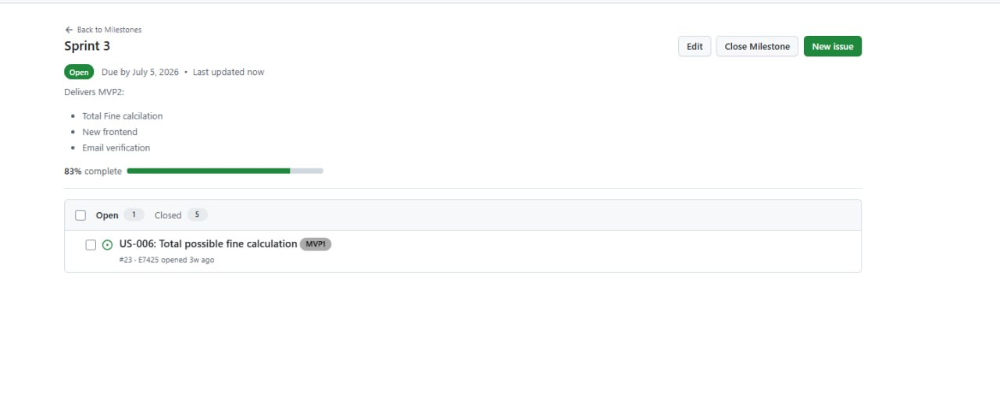
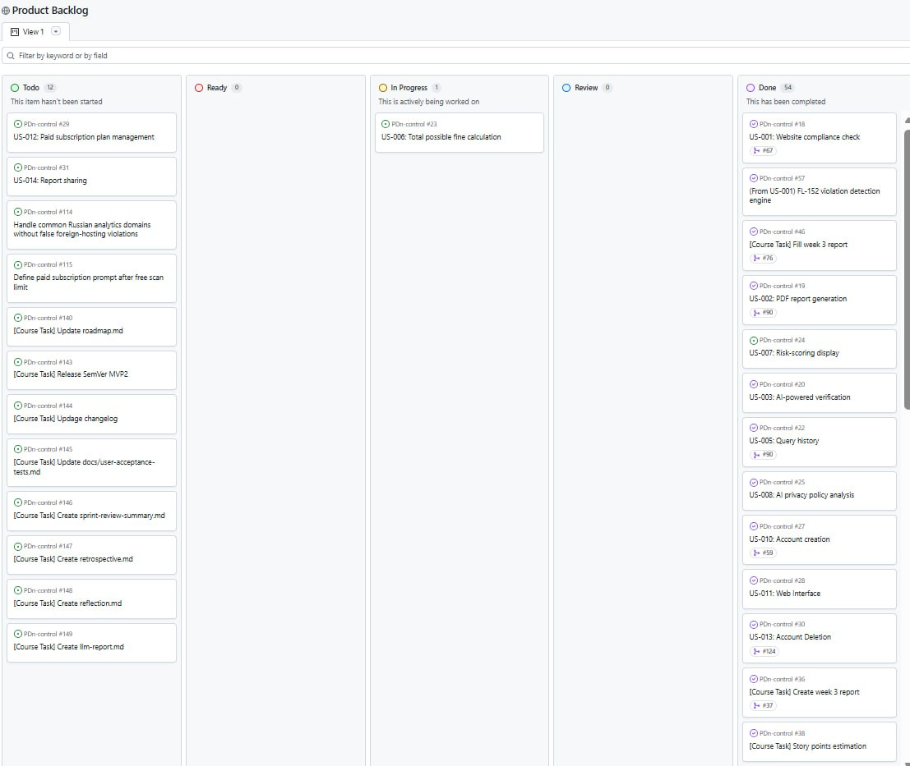
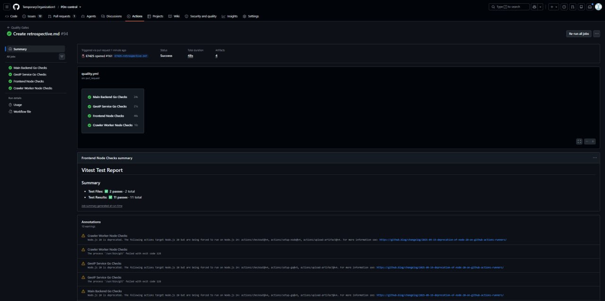
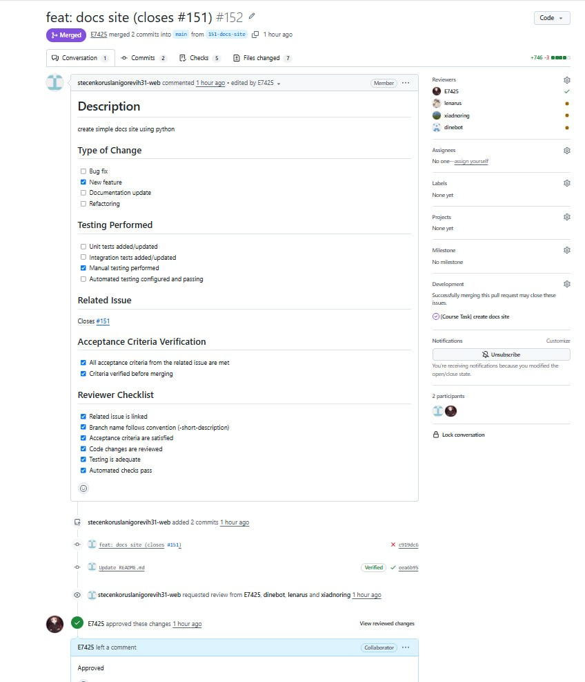
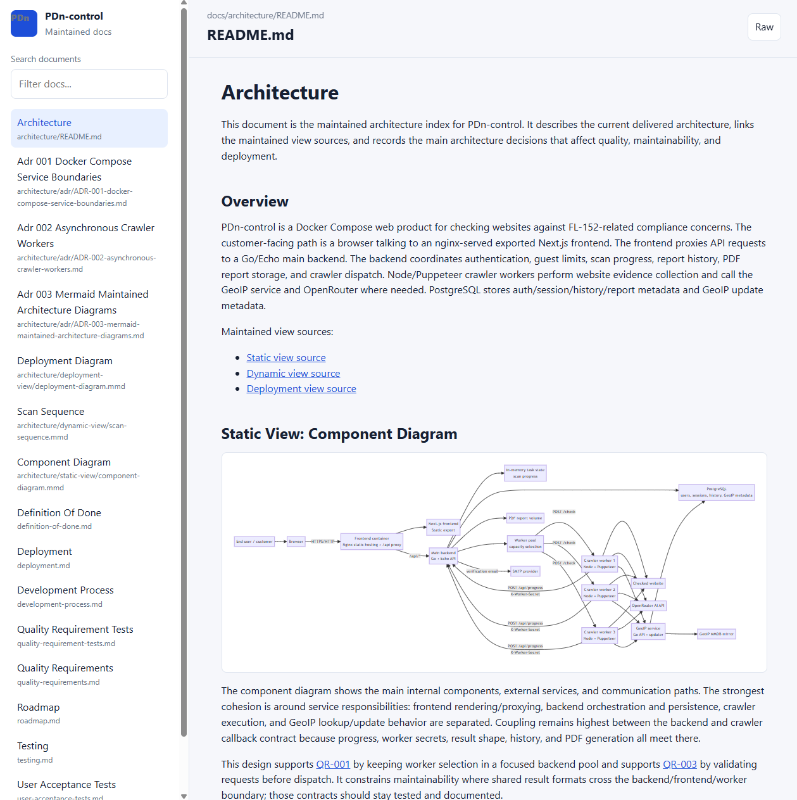
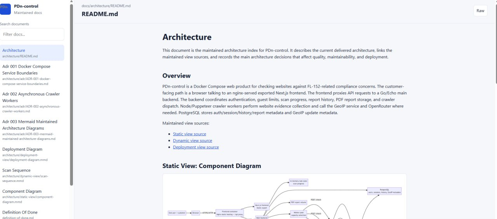

# Week 5 Report: Assignment 5

This is the public Week 5 evidence index for PDn-control. It links the maintained repository artifacts, hosted documentation, release evidence, CI evidence, Sprint Review artifacts, UAT summary, screenshots, and follow-up work for `MVP v2`.

## 1. Project

PDn-control is a website compliance checker for Federal Law No. 152 and related Russian regulations. It checks a submitted website, runs crawler-based and AI-assisted checks, shows detected risks, and produces user-facing evidence such as scan results and PDF reports.

Public product URL: [https://pdn2.neurolife.tech/](https://pdn2.neurolife.tech/)

## 2. Product Backlog

[Product Backlog board](https://github.com/orgs/TemporaryOrganization1/projects/2/views/1)

## 3. Sprint Backlog

[Sprint Backlog board](https://github.com/orgs/TemporaryOrganization1/projects/5)

## 4. Sprint 3 Milestone

[Sprint 3 milestone](https://github.com/TemporaryOrganization1/PDn-control/milestone/3)

## 5. Sprint Goal, Dates, And Scope

**Sprint Goal:** Improve the customer-facing design and add email verification so `MVP v2` is more trustworthy, understandable, and ready for customer review.

**Sprint dates:** 2026-06-29 to 2026-07-05.

**Short scope summary:** Sprint 3 focused on remaking the frontend design, adding email verification, improving maintained architecture/process/testing documentation, publishing a lightweight documentation site, updating UAT evidence, and preparing the `MVP v2` release.

## 6. Total Sprint Size

Total planned Sprint size: **8 Story Points**.

## 7. Delivered MVP v2 Changes

- Email verification was added to the registration flow.
- The frontend design was remade and reviewed with the customer.
- The project now has maintained architecture documentation, diagrams-as-code, and ADRs.
- Development process, configuration-management, testing, quality-requirement, and Definition of Done documentation were updated.
- A lightweight hosted documentation viewer was added.
- CI and QA evidence were kept active for the delivered increment.

## 8. Product Access Artifact

[Public deployed product](https://pdn2.neurolife.tech/)

## 9. Current Access Or Run Instructions

- [Root setup and run instructions](../../README.md)
- [Deployment notes](../../docs/deployment.md)
- [Documentation site run instructions](../../docs-site/README.md)

## 10. Customer Feedback Response Table

| Feedback point | Resulting PBI or issue | Status | Response |
|---|---|---|---|
| The site design looked too plain and did not feel like a polished SaaS product. | [#137](https://github.com/TemporaryOrganization1/PDn-control/issues/137) | Done for MVP v2, follow-up needed | The frontend was remade for `MVP v2`. During Sprint Review the customer still requested a stronger visual design, clearer product packaging, and better use of color/visual evidence. |
| Email verification should be implemented for account registration. | [#104](https://github.com/TemporaryOrganization1/PDn-control/issues/104) | Done | Email verification was implemented and demonstrated during the customer review. |
| The customer wanted clearer evidence in reports, including visual evidence from checked pages. | Follow-up backlog item needed | Deferred | The idea was discussed during Sprint Review and accepted as valuable, but it was not part of the completed `MVP v2` scope. |
| Total possible fine calculation remains useful for the product. | [#23](https://github.com/TemporaryOrganization1/PDn-control/issues/23) | In progress / deferred | The item remains open and is a candidate for the next Sprint. |

## 11. Feedback Not Addressed

The largest not-fully-addressed feedback point is the visual design polish. `MVP v2` includes a redesigned frontend, but the customer still requested a more professional SaaS-style visual presentation, better color palette, stronger call-to-action hierarchy, and more product evidence on the page. Visual evidence in reports and total fine calculation were also deferred to later work.

## 12. Roadmap

[docs/roadmap.md](../../docs/roadmap.md)

## 13. Definition Of Done

[docs/definition-of-done.md](../../docs/definition-of-done.md)

## 14. Testing

[docs/testing.md](../../docs/testing.md)

## 15. Quality Requirements

[docs/quality-requirements.md](../../docs/quality-requirements.md)

## 16. Quality Requirement Tests

[docs/quality-requirement-tests.md](../../docs/quality-requirement-tests.md)

## 17. User Acceptance Tests

[docs/user-acceptance-tests.md](../../docs/user-acceptance-tests.md)

## 18. Development Process

[docs/development-process.md](../../docs/development-process.md)

## 19. Architecture README

[docs/architecture/README.md](../../docs/architecture/README.md)

## 20. View Artifacts

- [Static component view source](../../docs/architecture/static-view/component-diagram.mmd)
- [Dynamic scan sequence source](../../docs/architecture/dynamic-view/scan-sequence.mmd)
- [Deployment view source](../../docs/architecture/deployment-view/deployment-diagram.mmd)

## 21. ADR Directory

- [ADR directory](../../docs/architecture/adr/)
- [ADR-001: Docker Compose Service Boundaries](../../docs/architecture/adr/ADR-001-docker-compose-service-boundaries.md)
- [ADR-002: Asynchronous Crawler Workers](../../docs/architecture/adr/ADR-002-asynchronous-crawler-workers.md)
- [ADR-003: Mermaid Maintained Architecture Diagrams](../../docs/architecture/adr/ADR-003-mermaid-maintained-architecture-diagrams.md)

## 22. Architecture Summary

PDn-control is deployed as a Docker Compose product with a customer-facing nginx/Next.js frontend, a Go/Echo main backend, PostgreSQL persistence, PDF report storage, crawler-worker containers, a GeoIP service, and external integrations with submitted websites, OpenRouter, SMTP, and the GeoIP MMDB mirror. The architecture keeps UI delivery, backend orchestration, long-running crawler execution, jurisdiction lookup, persistence, and report storage in separate components so the product can accept scans quickly and isolate crawler work from the initial request.

The current design supports `MVP v2` by making the main website-checking flow understandable from three maintained views: static component structure, dynamic scan sequence, and deployment topology. The main maintainability constraint remains the shared result/progress contract between the frontend, backend, and crawler workers, so this boundary is documented and covered by automated tests.

## 23. Quality Requirements And Architecture Decisions

The maintained quality requirements link directly to ADRs in [docs/quality-requirements.md](../../docs/quality-requirements.md). [QR-001 scan dispatch responsiveness](../../docs/quality-requirements.md#qr-001-scan-dispatch-responsiveness) is supported by [ADR-001](../../docs/architecture/adr/ADR-001-docker-compose-service-boundaries.md) and [ADR-002](../../docs/architecture/adr/ADR-002-asynchronous-crawler-workers.md), because service boundaries and asynchronous workers keep long crawler work outside the initial scan request. [QR-002 crawler type-check feedback](../../docs/quality-requirements.md#qr-002-type-check-feedback-for-crawler-changes) is linked to [ADR-003](../../docs/architecture/adr/ADR-003-mermaid-maintained-architecture-diagrams.md), which keeps architecture evidence maintainable and reviewable together with implementation changes. [QR-003 invalid input protection](../../docs/quality-requirements.md#qr-003-invalid-input-protection) is linked to [ADR-001](../../docs/architecture/adr/ADR-001-docker-compose-service-boundaries.md) and [ADR-002](../../docs/architecture/adr/ADR-002-asynchronous-crawler-workers.md), because validation happens before downstream scan dispatch.

## 24. Testing And CI Status Summary

The delivered increment keeps the Assignment 4 quality gates active and extends the maintained QA evidence for Assignment 5 architecture and ADR traceability. The latest protected-default-branch `Quality Gates` run on `main` passed for Go formatting, Go static analysis, backend and GeoIP Go tests with coverage artifacts, frontend lint/typecheck/build/Vitest coverage, crawler-worker typecheck/tests/coverage, automated quality requirement tests, and dependency vulnerability scans. The latest protected-default-branch `Link Checker` run on `main` also passed with the documented exclusions for local, course-material, generated, and temporarily unavailable deployment links.

## 25. CI Pipeline

- [Quality Gates workflow](https://github.com/TemporaryOrganization1/PDn-control/actions/workflows/quality.yml)
- [Link Checker workflow](https://github.com/TemporaryOrganization1/PDn-control/actions/workflows/link-check.yml)

## 26. Latest Protected-Default-Branch CI Run

- [Latest successful Quality Gates run on `main`](https://github.com/TemporaryOrganization1/PDn-control/actions/runs/28753858386) for commit `c17ada77785d34efe9274e395220a220d96539a6`.
- [Latest successful Link Checker run on `main`](https://github.com/TemporaryOrganization1/PDn-control/actions/runs/28753858410) for the same protected-default-branch commit.

## 27. SemVer Release

[MVP v2 release: v2.0.0 / tag `MVP2`](https://github.com/TemporaryOrganization1/PDn-control/releases/tag/MVP2)

## 28. CHANGELOG

[CHANGELOG.md](../../CHANGELOG.md)

## 29. Public Sanitized Demo Video

[Public sanitized demo video](https://drive.google.com/file/d/1y1T_cCwQ9ZZwwhXaKJBsl1hPxnJQwYSu/view?usp=sharing)

## 30. Public Sanitized UAT Results Summary

The customer reviewed the `MVP v2` increment during the recorded meeting. Email verification was demonstrated successfully: registration sent a verification email, the verification link was opened, and the account became usable after verification. The customer also confirmed the UAT point for PDF report functionality verbally at the end of the meeting. The product profile/history area and result page were shown.

Passed or accepted UAT areas:

- Email verification for registration.
- Access to profile/account area after verification.
- PDF report functionality accepted during the customer discussion.

Needs follow-up:

- Improve product visual design and landing page presentation.
- Consider adding screenshots or visual evidence to scan results and reports.
- Continue total possible fine calculation work.

## 31. Hosted Documentation Site

[Hosted documentation site](http://194.87.95.22:8088/)

## 32. Sprint Review Transcript

- [Sprint Review transcript](sprint-review-transcript.md)
- [Sprint Review summary](sprint-review-summary.md)

The raw customer recording link is not committed to the public repository because the Assignment 5 instructions require private recordings and customer-identifying recording evidence to be shared through Moodle or another private instructor channel.

## 33. Deviations

- The release is published as release name `v2.0.0`, but the repository tag is `MVP2` rather than a `v`-prefixed SemVer tag.
- The raw Sprint Review/customer recording is intentionally not linked from this public report; it should be submitted privately.
- A separate SemVer release screenshot was not provided in the attached screenshots, so this report links the public release page instead.

## 34. Sprint Review Summary

[reports/week5/sprint-review-summary.md](sprint-review-summary.md)

## 35. Reflection

[reports/week5/reflection.md](reflection.md)

## 36. Retrospective

[reports/week5/retrospective.md](retrospective.md)

## 37. LLM Report

[reports/week5/llm-report.md](llm-report.md)

## 38. Current Product Status

`MVP v2` is available as a deployed web product and includes the main website compliance check flow, frontend UI, account registration with email verification, profile/history-related user flow, PDF report support, crawler workers, GeoIP service, OpenRouter integration, maintained architecture documentation, updated process/QA documentation, and a hosted documentation site. The product is usable for customer review, but still needs visual design polish and additional report evidence improvements.

## 39. Next Steps

- Improve the landing page and application visual design using a stronger SaaS-style layout, palette, hierarchy, and product visuals.
- Add or refine visual evidence in scan results and PDF reports.
- Finish total possible fine calculation.
- Keep architecture, ADR, testing, and Definition of Done documentation current as product boundaries change.
- Continue tightening UAT evidence and release evidence for future increments.

## 40. Contribution Traceability

| Team member | Contributions and evidence |
|---|---|
| Ruslan Stetsenko | Frontend implementation and integration support, email-verification/proxy work, Week 5 README/report completion, design follow-up ownership from Sprint Review, PR/release evidence handling including [#156](https://github.com/TemporaryOrganization1/PDn-control/pull/156). |
| Egor Oleshko | Sprint coordination, documentation/reporting ownership, customer review facilitation, roadmap/report artifacts, backlog and Sprint Review discussion. |
| Lenar Gabdrakhimov | Backend support and account-related work, including account/profile behavior discussed during Sprint Review. |
| Timur Zainullin | Crawler-worker work and proposed visual evidence improvement for scan results/reports, discussed with the customer during Sprint Review. |
| Dinislam Baizigitov | Backend implementation support and service-side product work. |
| Team | Architecture documentation, ADRs, testing/QA documentation, hosted docs site, UAT execution, Sprint Review, retrospective, and `MVP v2` release preparation. |

## 41. Screenshots

### Sprint milestone

### Board or project workflow view

### Latest protected-default-branch CI run

### SemVer release

Release evidence is linked in item 27. A release screenshot was not included in the attached screenshot set.

### Example reviewed issue-linked PR

### Hosted docs site

Additional hosted docs screenshot:

## 42. Product Access Screenshots

No separate product access screenshot is embedded because the public product URL is directly accessible at [https://pdn2.neurolife.tech/](https://pdn2.neurolife.tech/). If deployment access becomes restricted before grading, add a product-access screenshot and private access instructions through the Moodle submission wrapper.
