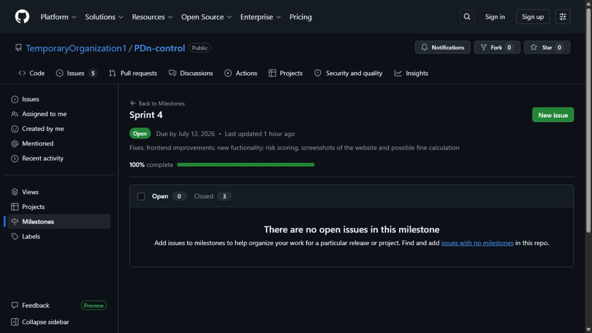
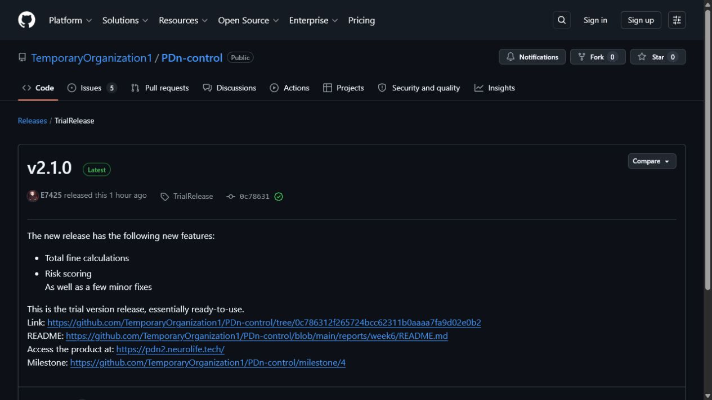
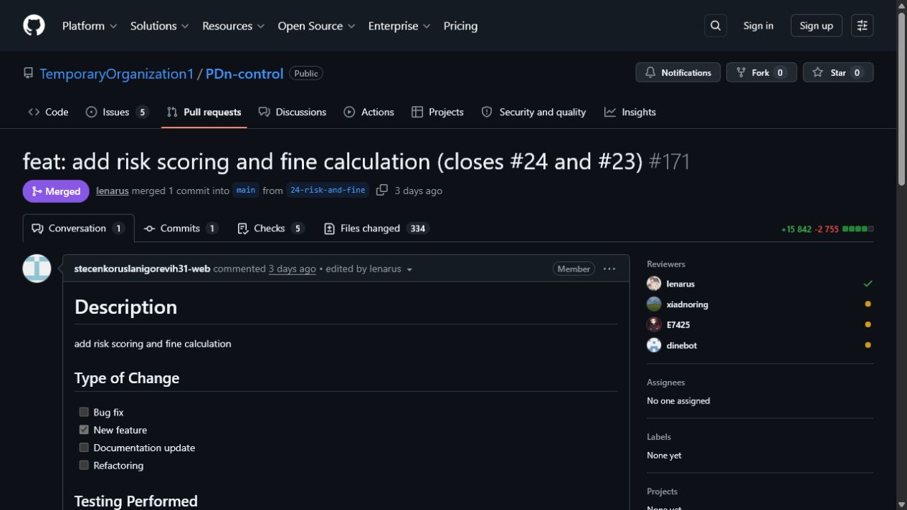

# PDn-control — Week 6 / Sprint 4 Trial Report

PDn-control is a legal-tech website checker for risks related to Russian personal-data law, especially Federal Law No. 152. A user submits a public website URL, the product collects technical and page evidence, classifies risks, and returns a structured report with possible fines and PDF output. It is a primary compliance-risk screen, not a legal opinion.

This document is the canonical public report for Week 6 of Assignment 6. It indexes the Sprint 4 trial increment, customer trial, maintained documentation, and public evidence. Private recordings, exact timecodes, credentials, access instructions, consent evidence, and the presentation/rehearsal video are intentionally excluded and belong only in the Week 6 Moodle PDF.

## Sprint 4 at a glance

| Item | Evidence |
|---|---|
| Product Backlog board | [GitHub Project #2](https://github.com/orgs/TemporaryOrganization1/projects/2) |
| Sprint Backlog board/view | **TODO — team input required.** A separate saved Sprint 4 GitHub Project view was not found in public evidence. The selected scope is inspectable through the [Sprint 4 milestone](https://github.com/TemporaryOrganization1/PDn-control/milestone/4), but Assignment 6 requires a platform-based Sprint Backlog view as well. |
| Sprint milestone | [Sprint 4](https://github.com/TemporaryOrganization1/PDn-control/milestone/4) — 100% complete; 3 closed items; due 2026-07-12 |
| Sprint dates | 2026-07-06 to 2026-07-12 |
| Sprint Goal | Deliver a customer-accessible trial increment by adding risk scoring and total possible fine calculation, completing supporting fixes, and recording customer-trial and transition-readiness evidence. |
| Selected user stories | [US-006 — Total possible fine calculation](https://github.com/TemporaryOrganization1/PDn-control/issues/23) and [US-007 — Risk-scoring display](https://github.com/TemporaryOrganization1/PDn-control/issues/24) |
| Sprint size | 16 Story Points: US-006 (3) and US-007 (13) |
| Trial release | [v2.1.0 trial release](https://github.com/TemporaryOrganization1/PDn-control/releases/tag/TrialRelease) published on 2026-07-12 from commit [`0c78631`](https://github.com/TemporaryOrganization1/PDn-control/commit/0c786312f265724bcc62311b0aaaa7fa9d02e0b2) on `main` |
| Public product access | [https://pdn2.neurolife.tech/](https://pdn2.neurolife.tech/) |

### Week 6 release status

The public release page calls the increment `v2.1.0` and links the product, the Week 6 report, and the Sprint 4 milestone. The release tag is currently `TrialRelease`, not a `v`-prefixed SemVer tag. This is an Assignment 6 compliance gap: the team must create or retag the Week 6 release with a valid tag such as `v2.1.0` before final submission.

## Delivered trial increment

The Sprint 4 trial increment combined the central user-facing requirements with supporting maintenance:

- [PR #171](https://github.com/TemporaryOrganization1/PDn-control/pull/171) delivered risk scoring and total possible fine calculation, closed [US-006](https://github.com/TemporaryOrganization1/PDn-control/issues/23) and [US-007](https://github.com/TemporaryOrganization1/PDn-control/issues/24), and records a peer approval plus five passing checks.
- [PR #177](https://github.com/TemporaryOrganization1/PDn-control/pull/177) added country flags and a real-time check journal.
- [PR #175](https://github.com/TemporaryOrganization1/PDn-control/pull/175) added the customer-handover guidance and updated the repository entry point.
- Supporting crawler, proxy, frontend, documentation, UAT, roadmap, changelog, and Sprint Review work was merged during the Sprint; the public commit history provides the detailed traceability.

The resulting flow lets a user submit a URL, follow scan progress, review evidence-backed findings, see a possible fine and risk priority, and access a PDF report when generated.

## Access, handover, and documentation

### Product access and usage

The trial product is available at [pdn2.neurolife.tech](https://pdn2.neurolife.tech/). The current public path is:

1. Enter a public website URL.
2. Start the compliance-risk check.
3. Wait for scan progress to finish.
4. Review the result and supporting evidence.
5. Open the generated PDF report where available.

The [customer handover guide](../../docs/customer-handover.md) contains the current setup, verification, recovery, configuration, and troubleshooting guidance. It also explains which production responsibilities and secrets are intentionally retained by the team.

### Customer-facing documentation review

The Week 6 meeting covered the product, documentation and transition readiness. The customer stated that the documentation was adequate for the academic requirement, but did not request an operational documentation packet. The maintained documentation set is publicly available through:

- [Repository README](../../README.md)
- [Customer handover guide](../../docs/customer-handover.md)
- [Deployment and recovery notes](../../docs/deployment.md)
- [Hosted documentation site](http://194.87.95.22:8088/)

What was clear: the product’s public access path and the improved result/evidence presentation. What remained unclear or open for the final transition: the actual customer operating model, repository-access arrangement, and confirmation that the handover guide is sufficient for the reached level. These points require explicit Week 7 confirmation rather than inference from the Week 6 meeting.

### Transition readiness at the end of Week 6

The public deployment, source repository, Docker Compose topology, API contract, tests, and maintained documentation are available for customer, TA, and reviewer access. The customer tried the product with team guidance during the Week 6 meeting.

The public evidence supports the handover level **Ready for independent use**. It does **not** evidence independent customer operation or deployment on the customer’s infrastructure. The current customer-confirmation status remains **Not yet accepted** until the Week 7 transition confirmation is recorded.

Week 7 must therefore:

1. polish the PDF report layout;
2. define and implement a meaningful free/paid functional split;
3. complete the agreed repository-access or handover arrangement; and
4. record the customer’s final handover confirmation and update `docs/customer-handover.md` and the Week 7 report accordingly.

## Customer trial, UAT, and feedback

The customer trial and Sprint Review took place on 2026-07-11. The detailed public record is available in the [Sprint Review transcript](sprint-review-transcript.md) and [Sprint Review summary](sprint-review-summary.md).

### Relevant UAT results

| Scenario | Week 6 result | Evidence |
|---|---|---|
| [UAT-006 — Screenshot generation](../../docs/user-acceptance-tests.md#uat-006-screenshot-generation) | Passed. The customer saw the screenshots in scan results and approved the scenario. | [Transcript](sprint-review-transcript.md), [UAT record](../../docs/user-acceptance-tests.md#uat-006-screenshot-generation) |
| [UAT-007 — Invalid input](../../docs/user-acceptance-tests.md#uat-007-invalid-input) | Passed. The customer approved the prevention of non-website input. | [Transcript](sprint-review-transcript.md), [UAT record](../../docs/user-acceptance-tests.md#uat-007-invalid-input) |
| [UAT-001 — Website compliance check](../../docs/user-acceptance-tests.md#uat-001-run-a-website-compliance-check) | The result/PDF flow was demonstrated, but the customer requested PDF layout polishing. It should be rechecked after the Week 7 fix rather than reported as fully accepted for the final increment. | [Sprint Review summary](sprint-review-summary.md) |

### Customer feedback and response

| Feedback point | Week 6 evidence | Response / resulting work | Status at the end of Week 6 |
|---|---|---|---|
| The product design now looks more like a real product. | The customer said that the design had improved and called it “close to a product.” | Preserve the redesigned interface and evidence-first report presentation. | Positive trial feedback; preserve during Week 7. |
| Screenshots improve the usefulness of findings. | The customer noticed the screenshot feature and approved UAT-006. | Keep screenshot evidence in scan results and reports. | Accepted; maintain during Week 7. |
| Invalid URLs must be rejected. | The customer approved UAT-007. | Keep frontend/backend validation and automated invalid-input protection. | Accepted; maintain during Week 7. |
| PDF report layout shifts and needs polishing. | The customer asked the team to make the PDF generator “normal” and noted shifting content. | Create/complete a Week 7 PDF-layout PBI, then rerun the report UAT. | Not yet addressed. |
| A free/paid model should limit functionality, not merely the number of scans. | The customer rejected a simple scan-count limit and asked for one coherent proposal. | Define a limited free scan by depth, criteria, or visibility of results; confirm the proposal with the customer. | Not yet addressed. |
| Handover should be practical, for example via repository access or an archive. | The customer said that a ZIP file or repository access would be acceptable and that the team may remain in the repository. | Record the agreed access arrangement privately where necessary and summarize the final state publicly in Week 7. | Pending Week 7 confirmation. |

## Engineering, process, and quality evidence

Sprint 4 preserved the maintained product controls introduced in earlier assignments:

- [Architecture and ADR index](../../docs/architecture/README.md) documents the frontend, Go/Echo backend, three asynchronous Node/Puppeteer crawler workers, GeoIP service, PostgreSQL, PDF storage, and callback boundary.
- [Testing and QA status](../../docs/testing.md), [quality requirements](../../docs/quality-requirements.md), and [quality requirement tests](../../docs/quality-requirement-tests.md) describe the 30% critical-module coverage baseline, three automated QRTs, CI quality gates, dependency-vulnerability scanning, and link checking.
- [User acceptance tests](../../docs/user-acceptance-tests.md) preserve the active customer-facing scenarios and the Week 6 results for screenshots and invalid input.
- [Development process](../../docs/development-process.md), [Definition of Done](../../docs/definition-of-done.md), [CONTRIBUTING.md](../../CONTRIBUTING.md), and [AGENTS.md](../../AGENTS.md) define issue-linked branches, peer review, CI gates, secrets handling, and documentation responsibilities.
- [Roadmap](../../docs/roadmap.md), [deployment notes](../../docs/deployment.md), [OpenAPI contract](../../api/openapi.yaml), and [CHANGELOG](../../CHANGELOG.md) provide the current planning, operation, API, and user-visible-change context.

The latest linked protected-branch evidence in the testing document reports passing Quality Gates and Link Checker runs. The public deployment is excluded from automated link checking because maintenance can temporarily affect availability; it should be smoke-checked manually before grading.

## Supporting Week 6 artifacts

- [Trial release](https://github.com/TemporaryOrganization1/PDn-control/releases/tag/TrialRelease)
- [Sprint Review transcript](sprint-review-transcript.md)
- [Sprint Review summary](sprint-review-summary.md)
- [Week 6 reflection](reflection.md)
- [Week 6 retrospective](retrospective.md)
- [Week 6 LLM usage report](llm-report.md)
- [Current changelog](../../CHANGELOG.md)

## Current status and Week 7 follow-up

The Week 6 trial increment is publicly deployed and contains the core risk-scoring, possible-fine, evidence, and report flow. The customer recognised the visual and product-quality progress, while identifying two product-critical follow-ups: PDF report layout quality and a coherent free/paid feature split.

The team must also convert the current trial-release tag to a valid `v`-prefixed SemVer tag, establish the Sprint 4 board/view link, complete handover confirmation, and keep public/private evidence separated. The Week 7 report must index the final `MVP v3` release, transition outcome, public demo video, and all Week 6 evidence.

## Contribution traceability

| Team member | Sprint 4 contribution evidence |
|---|---|
| Dinislam Baizigitov — Scrum Master / Backend | Sprint Review and customer-trial evidence through [PR #176](https://github.com/TemporaryOrganization1/PDn-control/pull/176); Scrum coordination reflected in the Week 6 meeting and report artifacts. |
| Egor Oleshko — Product Owner / Team Lead | Backlog, roadmap, UAT, changelog, report and reflection artifacts through [PR #187](https://github.com/TemporaryOrganization1/PDn-control/pull/187), [PR #188](https://github.com/TemporaryOrganization1/PDn-control/pull/188), [PR #189](https://github.com/TemporaryOrganization1/PDn-control/pull/189), [PR #190](https://github.com/TemporaryOrganization1/PDn-control/pull/190), and [PR #191](https://github.com/TemporaryOrganization1/PDn-control/pull/191). |
| Ruslan Stecenko — Developer / Frontend + Backend | Risk scoring and total possible fine calculation in [PR #171](https://github.com/TemporaryOrganization1/PDn-control/pull/171); customer-handover and repository-entry-point update in [PR #175](https://github.com/TemporaryOrganization1/PDn-control/pull/175); deployment/proxy maintenance in [PR #170](https://github.com/TemporaryOrganization1/PDn-control/pull/170). |
| Timur Zainullin — Developer / Backend + Frontend | Crawler maintenance in [PR #169](https://github.com/TemporaryOrganization1/PDn-control/pull/169) and merge activity connected to the Week 6 handover update in [PR #175](https://github.com/TemporaryOrganization1/PDn-control/pull/175). |
| Lenar Gabdrakhimov — Developer / Backend | Country flags and real-time journal in [PR #177](https://github.com/TemporaryOrganization1/PDn-control/pull/177); peer approval and merge evidence for [PR #171](https://github.com/TemporaryOrganization1/PDn-control/pull/171). |

## Inspectable Week 6 evidence

### Sprint 4 milestone

[Open the public milestone](https://github.com/TemporaryOrganization1/PDn-control/milestone/4)

### Week 6 trial release

[Open the public trial release](https://github.com/TemporaryOrganization1/PDn-control/releases/tag/TrialRelease)

### Reviewed issue-linked pull request

[Open PR #171](https://github.com/TemporaryOrganization1/PDn-control/pull/171)

## Remaining information needed from the team

1. The direct URL of the saved GitHub Project view used as the Sprint 4 Backlog, if one exists. If it does not, create it before final submission.
2. A valid `v`-prefixed SemVer tag for the Week 6 trial release, or confirmation that the existing `TrialRelease` tag has been replaced.
3. The final Week 7 transition-confirmation evidence and repository-access outcome. Do not add private credentials, customer messages, recording links, or exact timecodes here; provide those only in the Moodle submission wrapper.
