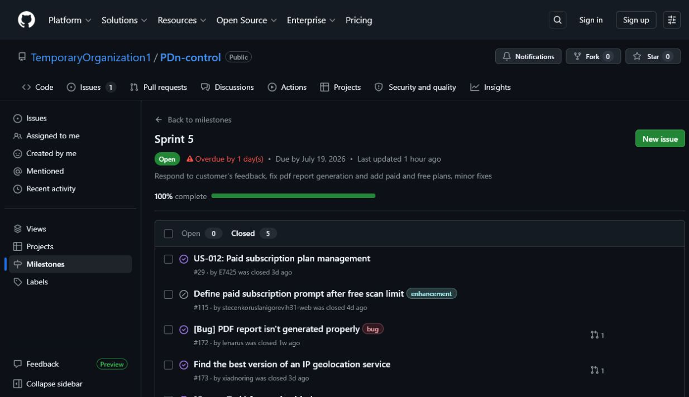
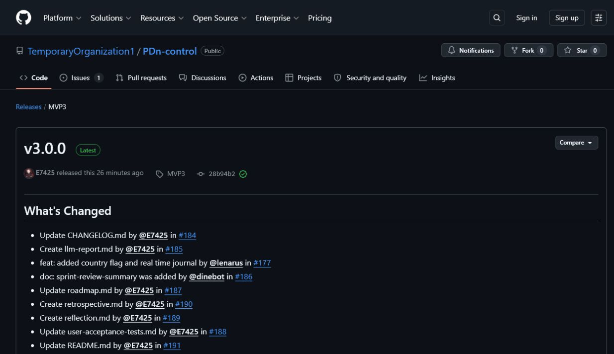
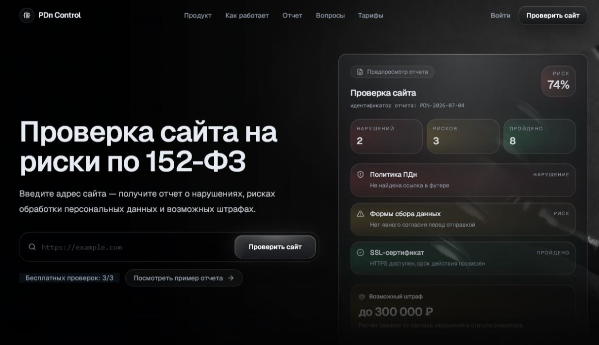
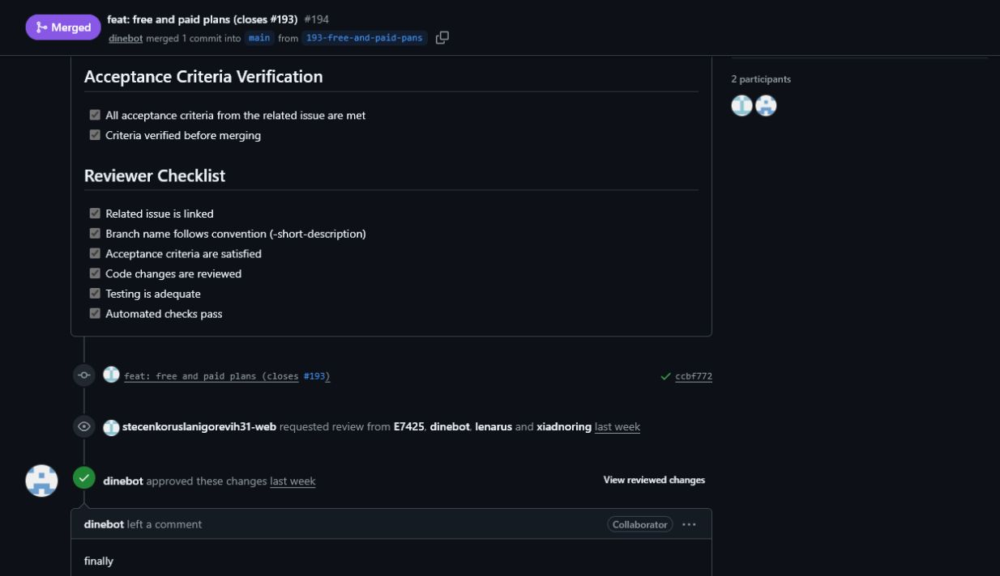

# Week 7 — Sprint 5

PDn-control is a legal-tech website checker for risks related to Russian personal-data law, especially Federal Law No. 152. This is the canonical public Week 7 report for Sprint 5 and the final Assignment 6 evidence index. It focuses on Week 7 follow-up maintenance, the transition outcome, and delivery of the customer-usable `MVP v3` increment.

Private recordings, exact timecodes, credentials, access instructions, consent evidence, customer-identifying evidence, presentation slides, and rehearsal-video evidence are intentionally excluded. They belong only in the Week 7 Moodle submission wrapper.

## Prior Sprint and Maintained Entry Points

- [Complete Week 6 canonical report and evidence index](../week6/README.md)
- [Final public product access](https://pdn2.neurolife.tech/)
- [Current access, setup, and run instructions](../../README.md)
- [Hosted documentation site](http://194.87.95.22:8088/)
- [Contributing guide](../../CONTRIBUTING.md)
- [AI-agent guidance](../../AGENTS.md)
- [Customer handover guide](../../docs/customer-handover.md)
- [Deployment and recovery guidance](../../docs/deployment.md)
- [Roadmap](../../docs/roadmap.md)
- [Testing and QA status](../../docs/testing.md)
- [Quality requirements](../../docs/quality-requirements.md) and [automated QRTs](../../docs/quality-requirement-tests.md)
- [User acceptance tests](../../docs/user-acceptance-tests.md)
- [Architecture and ADRs](../../docs/architecture/README.md)
- [Development process](../../docs/development-process.md) and [Definition of Done](../../docs/definition-of-done.md)
- [OpenAPI contract](../../api/openapi.yaml)
- [Changelog](../../CHANGELOG.md)
- [Week 7 LLM usage report](llm-report.md)

## Sprint 5 Container

| Item | Public evidence and current state |
|---|---|
| Product Backlog | [GitHub Project #2](https://github.com/orgs/TemporaryOrganization1/projects/2) |
| Sprint 5 Backlog | [GitHub Project #7](https://github.com/orgs/TemporaryOrganization1/projects/7). On 2026-07-20 the public board showed six items in `Done` and [#209 — Fill week7/README.md](https://github.com/TemporaryOrganization1/PDn-control/issues/209) in `Todo`; the final workflow update therefore still depends on review and merge of this report work. |
| Sprint 5 milestone | [Sprint 5 milestone #5](https://github.com/TemporaryOrganization1/PDn-control/milestone/5?closed=1): five closed items and 100% item completion, but the milestone remains open and overdue. It was created on 2026-07-20, after the reported Sprint end, so it does not independently evidence timely Sprint Planning. |
| Reported Sprint dates | 2026-07-13 to 2026-07-19. The public milestone records the 2026-07-19 due date but not a start date. |
| Sprint Goal | Respond to Week 6 customer feedback by implementing a meaningful Free/Paid split, correcting PDF report layout, improving IP geolocation reliability, completing minor product fixes, and preparing the final customer-usable course version for transition. |
| Recorded Sprint size | 13 Story Points are visible for [US-012 / #29](https://github.com/TemporaryOrganization1/PDn-control/issues/29). The other milestone items do not expose Story Point estimates, so 13 SP is the recorded estimated subset rather than a complete estimate of every delivered item. |

The milestone scope contains [US-012 / #29](https://github.com/TemporaryOrganization1/PDn-control/issues/29), [subscription prompt #115](https://github.com/TemporaryOrganization1/PDn-control/issues/115), [PDF defect #172](https://github.com/TemporaryOrganization1/PDn-control/issues/172), [IP geolocation #173](https://github.com/TemporaryOrganization1/PDn-control/issues/173), and [Free/Paid task #193](https://github.com/TemporaryOrganization1/PDn-control/issues/193). Issue #115 was closed as not planned; the other four were closed as completed. Several selected items lack the required acceptance criteria, estimate, implementer, or different reviewer metadata, and #193 is classified as a Course Task even though [PR #194](https://github.com/TemporaryOrganization1/PDn-control/pull/194) delivers product behavior. Those tracker gaps remain visible rather than being treated as compliant Sprint evidence.

## Current Week 7 Maintenance

Sprint 5 delivered the following inspectable changes:

- [PR #194](https://github.com/TemporaryOrganization1/PDn-control/pull/194) introduced server-enforced Guest/Free/Paid scan profiles, the rolling Free quota, 3/10 exploration budgets, honest `unknown` results, and Paid-only PDF/screenshot evidence. It closes [#193](https://github.com/TemporaryOrganization1/PDn-control/issues/193), while the parent plan story [#29](https://github.com/TemporaryOrganization1/PDn-control/issues/29) is not directly linked from the implementation PR.
- [PR #196](https://github.com/TemporaryOrganization1/PDn-control/pull/196) closed [PDF defect #172](https://github.com/TemporaryOrganization1/PDn-control/issues/172), and [PR #197](https://github.com/TemporaryOrganization1/PDn-control/pull/197) made a further PDF/image-layout improvement.
- [PR #198](https://github.com/TemporaryOrganization1/PDn-control/pull/198) aligned pricing, profile plan controls, navigation, redirects, and tests with the implemented 30-day self-service Paid activation; unsupported checkout and purchase-history placeholders were removed.
- [PR #199](https://github.com/TemporaryOrganization1/PDn-control/pull/199) and [PR #201](https://github.com/TemporaryOrganization1/PDn-control/pull/201) implemented and stabilized the GeoIP fallback work tracked by [#173](https://github.com/TemporaryOrganization1/PDn-control/issues/173).
- [PR #200](https://github.com/TemporaryOrganization1/PDn-control/pull/200), [PR #202](https://github.com/TemporaryOrganization1/PDn-control/pull/202), and [PR #203](https://github.com/TemporaryOrganization1/PDn-control/pull/203) supplied crawler and user-interface follow-up fixes.

The listed PRs were merged to `main`, have approval from a different contributor, and expose successful checks on their PR pages. On the protected-branch baseline at commit [`53dab20`](https://github.com/TemporaryOrganization1/PDn-control/commit/53dab2071a1878d9db47d8e8468cd72de36bc967), [Quality Gates](https://github.com/TemporaryOrganization1/PDn-control/actions/runs/29773767720) and [Link Checker](https://github.com/TemporaryOrganization1/PDn-control/actions/runs/29773768023) both passed on 2026-07-20. These runs predate the current local report corrections and are not claimed as verification of unmerged changes.

## Transition and Customer Evidence

| Required transition field | Publicly supported Week 7 conclusion |
|---|---|
| Handover level | **`Ready for independent use`**. The deployment, public repository, Docker Compose topology, API contract, tests, and maintained operating guidance are available. |
| Customer-confirmation status | **`Not yet accepted`**. The customer gave positive feedback on the demonstrated functionality, but the meeting did not include an explicit request or response accepting the current [customer handover guide](../../docs/customer-handover.md) as sufficient for the reached handover level. |
| Made available | Public product deployment, source repository, hosted documentation viewer, setup/deployment/recovery instructions, test and architecture documentation, and the final functional increment. See the [current transition scope](../../docs/customer-handover.md#transition-scope). |
| Retained or pending | Production secrets, account ownership, and private access details remain outside the public repository. Repository access for the customer was described in the meeting as a future action and is not yet evidenced as completed. |
| Customer-side use or operation | The public transcript records an oral acknowledgment of the team's statement that the product is hosted on the customer's side. No public deployment-ownership or customer-operation artifact independently verifies that stronger level, so the conservative public level remains `Ready for independent use`. |
| Remaining support and blockers | Grant and confirm repository access; explicitly ask the customer to accept or reject the current handover guide; record the resulting status; clarify ongoing deployment/support ownership; and refresh the hosted docs from the final repository state. |

The sanitized meeting evidence is indexed through the [Sprint Review summary](sprint-review-summary.md) and [public transcript draft](sprint-review-transcript.md). Permission to publish the transcript is not evidenced in the repository; this must be confirmed, otherwise the public transcript must be replaced with permitted sanitized notes. The private recording, exact timecodes, repository-access proof, and customer message evidence belong only in the Moodle wrapper.

## Customer Feedback and UAT

| Feedback or follow-up | Repository response | Week 7 status and traceability |
|---|---|---|
| Free and Paid must differ by useful functionality, not only scan count. | The backend now derives immutable scan profiles; Free omits PDF/screenshots and uses a shallower exploration budget, while Paid retains full evidence. | Addressed by [#29](https://github.com/TemporaryOrganization1/PDn-control/issues/29), [#193](https://github.com/TemporaryOrganization1/PDn-control/issues/193), and [PR #194](https://github.com/TemporaryOrganization1/PDn-control/pull/194). The direct PR-to-US-012 link remains a traceability gap. |
| PDF content shifted or overflowed and needed polishing. | The report generator layout and evidence-image handling were corrected and then refined. | Addressed by [#172](https://github.com/TemporaryOrganization1/PDn-control/issues/172), [PR #196](https://github.com/TemporaryOrganization1/PDn-control/pull/196), and [PR #197](https://github.com/TemporaryOrganization1/PDn-control/pull/197); the PDF was demonstrated in the Week 7 meeting. |
| Improve IP geolocation behavior used by technical findings. | The GeoIP lookup gained additional fallback behavior and a follow-up stabilization fix. | Addressed by [#173](https://github.com/TemporaryOrganization1/PDn-control/issues/173), [PR #199](https://github.com/TemporaryOrganization1/PDn-control/pull/199), and [PR #201](https://github.com/TemporaryOrganization1/PDn-control/pull/201). |
| Complete a practical repository/access transition. | Public source and operating guidance are available; customer repository access was promised after the meeting. | **Pending.** No public artifact proves that access was granted or that the current handover guide was explicitly accepted. |

| Maintained UAT | Week 7 public result | Evidence boundary or resulting work |
|---|---|---|
| [UAT-001 — Website compliance check](../../docs/user-acceptance-tests.md#uat-001-run-a-website-compliance-check) | **Passed for the demonstrated scan/report flow.** The meeting showed Free and Paid results and the Paid PDF, after which the customer reported no functional questions. | [Sprint Review summary](sprint-review-summary.md); PDF follow-up [#172](https://github.com/TemporaryOrganization1/PDn-control/issues/172) was closed by [PR #196](https://github.com/TemporaryOrganization1/PDn-control/pull/196). |
| [UAT-006 — Screenshot generation](../../docs/user-acceptance-tests.md#uat-006-screenshot-generation) | **Passed for the demonstrated Paid screenshot evidence.** | The meeting showed the screenshot in the Paid result. |
| [UAT-008 — Free scan restrictions and rolling quota](../../docs/user-acceptance-tests.md#uat-008-free-scan-restrictions-and-rolling-quota) | **Partial.** The concise Free result and absence of PDF/screenshots were shown. | The three-scan exhaustion, fourth rejection, and `/api/usage` response were not executed in the meeting; the maintained UAT still requires that evidence. |
| [UAT-009 — Paid scan artifacts survive plan expiry](../../docs/user-acceptance-tests.md#uat-009-paid-scan-artifacts-survive-plan-expiry) | **Not executed.** | Plan expiry and later artifact reopening were not covered. |
| [UAT-010 — Activate temporary Paid access from pricing](../../docs/user-acceptance-tests.md#uat-010-activate-temporary-paid-access-from-pricing) | **Partial.** Paid activation from the account plan area was demonstrated. | The complete signed-out pricing → authentication → return-to-plan sequence was not executed. |

UAT-007 was not re-executed in the Week 7 meeting and is not claimed as new Week 7 evidence. The [maintained UAT document](../../docs/user-acceptance-tests.md) must be synchronized with these partial execution results before final submission.

## Final Delivery Evidence Still Required

The public product increment is usable and the main Week 7 implementation evidence is inspectable, but the Assignment 6 delivery package is not yet fully compliant.

- **Available — product access:** [https://pdn2.neurolife.tech/](https://pdn2.neurolife.tech/) loaded successfully in a logged-out browser on 2026-07-20. Current setup and recovery paths are in the [repository README](../../README.md) and [deployment guide](../../docs/deployment.md).
- **Available with refresh follow-up — hosted docs:** [http://194.87.95.22:8088/](http://194.87.95.22:8088/) was reachable and browsable on 2026-07-20, but the displayed architecture content did not yet include all final entitlement/ADR updates visible on `main`; refresh and recheck it before submission.
- **Published but non-compliant — final release:** GitHub has a release named [`v3.0.0`](https://github.com/TemporaryOrganization1/PDn-control/releases/tag/MVP3), published from protected-`main` commit [`28b94b2`](https://github.com/TemporaryOrganization1/PDn-control/commit/28b94b23a954f8ae782663a4a4357a462b87594c). Its actual tag is `MVP3`, not the required `v`-prefixed SemVer tag, it predates the final Week 7 report update, and its notes do not link the Sprint 5 milestone, run/access instructions, handover guide, Week 7 report, or demo video. A compliant higher-precedence `v`-prefixed release is still required.
- **Gap — changelog:** [CHANGELOG.md](../../CHANGELOG.md) still keeps the final changes under `[Unreleased]`; no dated `3.0.0` section maps them to the release. The Week 6 release also uses the non-SemVer tag `TrialRelease`, as documented in the [Week 6 report](../week6/README.md#week-6-release-status).
- **Available, final content check pending — public demo:** [demo_sprint5.mp4](https://drive.google.com/file/d/1P9FkSNjZCICpxHYrX4GpiMOU7cJkfH1m/view?usp=sharing) was publicly viewable without sign-in on 2026-07-20. The team must still confirm that the complete video is sanitized, demonstrates Assignment 6 improvements, and stays under two minutes; the compliant release must link it.
- **Available with permission blocker — Sprint Review:** [sanitized summary](sprint-review-summary.md) and [sanitized transcript draft](sprint-review-transcript.md). Public transcript-publication permission is `TODO`; use permitted public notes instead if permission was refused.
- **Available — team learning and AI disclosure:** [Week 7 reflection](reflection.md), [Week 7 retrospective](retrospective.md), and [Week 7 LLM usage report](llm-report.md).
- **Team-reported, private proof required — Demo Day preparation:** the team reports that the presentation and Week 7 rehearsal were completed. Slides and rehearsal video must remain private and be included only in the required Moodle submissions; no public completion evidence is claimed here.

| Public GitHub identity | Sprint 5 contribution and review traceability |
|---|---|
| [`stecenkoruslanigorevih31-web`](https://github.com/stecenkoruslanigorevih31-web) | Implemented Free/Paid behavior in [PR #194](https://github.com/TemporaryOrganization1/PDn-control/pull/194) and pricing/profile/UI follow-up in [PR #198](https://github.com/TemporaryOrganization1/PDn-control/pull/198); approved PRs [#196](https://github.com/TemporaryOrganization1/PDn-control/pull/196), [#203](https://github.com/TemporaryOrganization1/PDn-control/pull/203), [#207](https://github.com/TemporaryOrganization1/PDn-control/pull/207), [#208](https://github.com/TemporaryOrganization1/PDn-control/pull/208), and [#210](https://github.com/TemporaryOrganization1/PDn-control/pull/210). |
| [`dinebot`](https://github.com/dinebot) | Implemented PDF fixes in [PR #192](https://github.com/TemporaryOrganization1/PDn-control/pull/192), [#196](https://github.com/TemporaryOrganization1/PDn-control/pull/196), and [#197](https://github.com/TemporaryOrganization1/PDn-control/pull/197), and prepared Sprint Review artifacts in [PR #204](https://github.com/TemporaryOrganization1/PDn-control/pull/204); approved [PR #194](https://github.com/TemporaryOrganization1/PDn-control/pull/194). |
| [`lenarus`](https://github.com/lenarus) | Implemented GeoIP work in [PR #199](https://github.com/TemporaryOrganization1/PDn-control/pull/199) and [PR #201](https://github.com/TemporaryOrganization1/PDn-control/pull/201); approved PRs [#200](https://github.com/TemporaryOrganization1/PDn-control/pull/200), [#202](https://github.com/TemporaryOrganization1/PDn-control/pull/202), and [#204](https://github.com/TemporaryOrganization1/PDn-control/pull/204). |
| [`xiadnoring`](https://github.com/xiadnoring) | Implemented crawler/UI maintenance in [PR #200](https://github.com/TemporaryOrganization1/PDn-control/pull/200), [#202](https://github.com/TemporaryOrganization1/PDn-control/pull/202), and [#203](https://github.com/TemporaryOrganization1/PDn-control/pull/203); approved PRs [#197](https://github.com/TemporaryOrganization1/PDn-control/pull/197), [#198](https://github.com/TemporaryOrganization1/PDn-control/pull/198), [#199](https://github.com/TemporaryOrganization1/PDn-control/pull/199), and [#201](https://github.com/TemporaryOrganization1/PDn-control/pull/201). |
| [`E7425`](https://github.com/E7425) | Prepared the retrospective, reflection, and Week 7 index through [PR #207](https://github.com/TemporaryOrganization1/PDn-control/pull/207), [#208](https://github.com/TemporaryOrganization1/PDn-control/pull/208), and [#210](https://github.com/TemporaryOrganization1/PDn-control/pull/210). |

**Sprint 5 milestone — public state on 2026-07-20**

[Open the milestone](https://github.com/TemporaryOrganization1/PDn-control/milestone/5?closed=1)

**Published final-release page**

[Open the release named v3.0.0](https://github.com/TemporaryOrganization1/PDn-control/releases/tag/MVP3)

**Final public product access**

[Open PDn-control](https://pdn2.neurolife.tech/)

**Reviewed issue-linked implementation PR**

[Open PR #194](https://github.com/TemporaryOrganization1/PDn-control/pull/194)

**Final product status:** the customer-facing `MVP v3` functionality is deployed and the demonstrated Free/Paid, PDF, screenshot, and IP-checking behavior received positive functional feedback. Final Assignment 6 closure still requires a compliant SemVer release and changelog section, completion of repository access and explicit handover-guide confirmation, synchronization of maintained UAT/handover documentation and hosted docs, transcript-publication permission, final demo validation, and review/merge of this report. Until those actions are evidenced, this report must not claim a completed or fully accepted transition.
